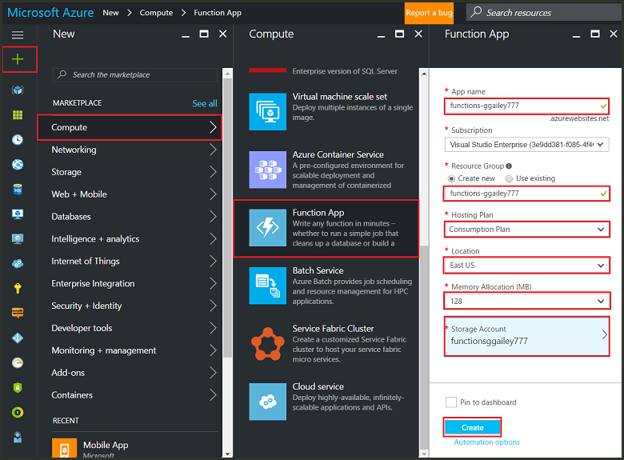

1. Select the **New** button found on the upper left-hand corner of the Azure portal, then select **Compute** > **Function App**.

    

2. Use the function app settings as specified in the table below the image.

    

    | Setting      | Suggested value  | Description                                        |
    | ------------ |  ------- | -------------------------------------------------- |
    | **App name** | Globally unique name | Name that identifies your new function app. Valid characters are `a-z`, `0-9`, and `-`.  | 
    | **Subscription** | Your subscription | The subscription under which this new function app is created. | 
    | **[Resource Group](../articles/azure-resource-manager/resource-group-overview.md)** |  myResourceGroup | Name for the new resource group in which to create your function app. |
    | **OS** | Windows | Serverless hosting is currently only available when running on Windows. For Linux hosting, see [Create your first function running on Linux using the Azure CLI](../articles/azure-functions/functions-create-first-azure-function-azure-cli-linux.md). |
    | **[Hosting plan](../articles/azure-functions/functions-scale.md)** | Consumption plan | Hosting plan that defines how resources are allocated to your function app. In the default **Consumption Plan**, resources are added dynamically as required by your functions. In this [serverless](https://azure.microsoft.com/overview/serverless-computing/) hosting, you only pay for the time your functions run. When you run in an App Service plan, you must manage the [scaling of your function app](../articles/azure-functions/functions-scale.md).  |
    | **Location** | West Europe | Choose a [region](https://azure.microsoft.com/regions/) near you or near other services your functions access. |
    | **Runtime stack** | Preferred language | Choose a runtime that supports your favorite function programming language. Choose **.NET** for C# and F# functions. |
    | **[Storage](../articles/storage/common/storage-quickstart-create-account.md)** |  Globally unique name |  Create a storage account used by your function app. Storage account names must be between 3 and 24 characters in length and may contain numbers and lowercase letters only. You can also use an existing account, which must meets the [storage account requirements](../articles/azure-functions/functions-scale.md#storage-account-requirements). |
    | **[Application Insights](../articles/azure-functions/functions-monitoring.md)** | Default | Application Insights is enabled by default. Choose a location near your function app.  |

3. Select **Create** to provision and deploy the function app.

4. Select the Notification icon in the upper-right corner of the portal and watch for the **Deployment succeeded** message.

    

5. Select **Go to resource** to view your new function app.

> [!TIP]
> Having trouble finding your function apps in the portal, try [adding Function Apps to your favorites in the Azure portal](../articles/azure-functions/functions-how-to-use-azure-function-app-settings.md#favorite).
