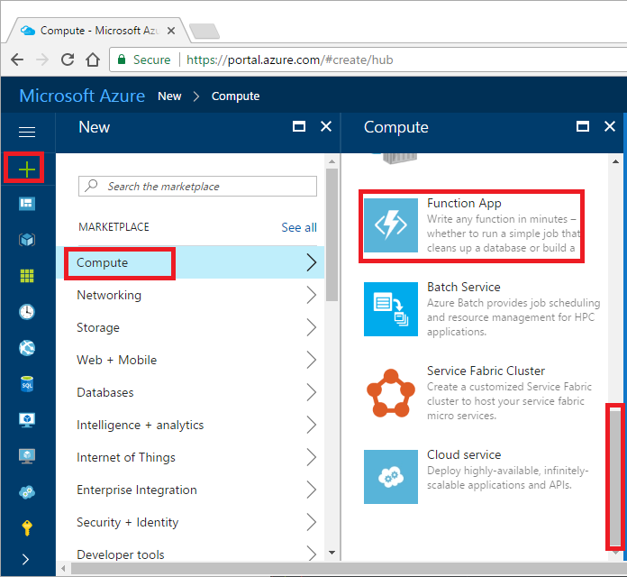
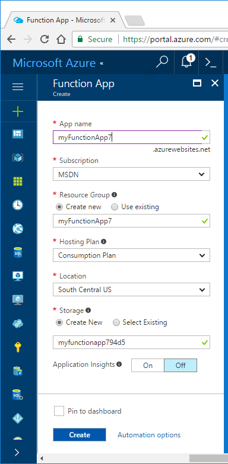

A function app hosts the execution of your functions. A function app lets you group functions as a logic unit for easier management, deployment, and sharing of resources.

Select **New** > **Compute** > **Function App**:

Enter the required fields:

| Field               | Sample value | Comment |
| ----------------- | ------------ | ------------- |
| App name | myFunctionApp | Enter a unique name. |
| Subscription | MSDN | Select your subscription. |
| Resource Group | myFunctionApp | Create a new resource group. |
| Hosting Plan | Consumption plan |  Billed based on resource consumption. |
| Location | West US  | Select a location near you. |
| Storage | myFunctionApp123  | Create a new storage account. |

Select **Create** to provision and deploy the new function app.  
