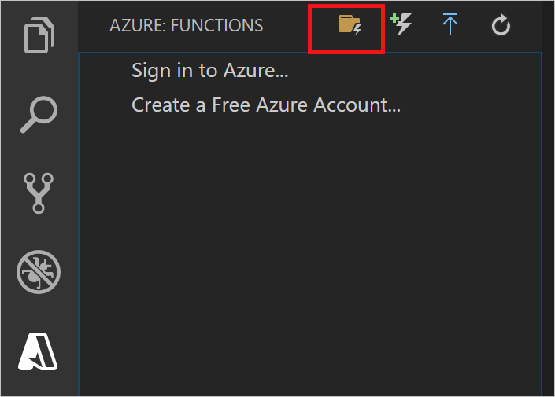
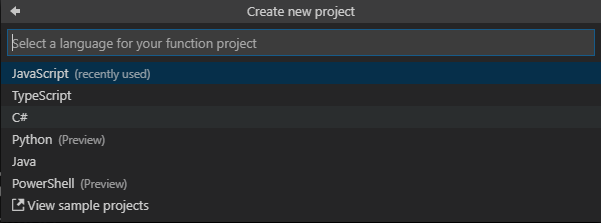

## Create an Azure Functions project

The Azure Functions project template in Visual Studio Code creates a project that can be published to a function app in Azure. A function app lets you group functions as a logical unit for management, deployment, and sharing of resources.

1. In Visual Studio Code, select the Azure logo to display the **Azure: Functions** area, and then select the Create New Project icon.

    

1. Choose a location for your project workspace and choose **Select**.

    > [!NOTE]
    > This article was designed to be completed outside of a workspace. In this case, do not select a project folder that is part of a workspace.

1. Select the language for your function app project. In this article, JavaScript is used.
    

1. When prompted, choose **Add to workspace**.

Visual Studio Code creates the function app project in a new workspace. This project contains the [host.json](../articles/azure-functions/functions-host-json.md) and [local.settings.json](../articles/azure-functions/functions-run-local.md#local-settings-file) configuration files, plus any language-specific project files. You also get a new Git repository in the project folder.