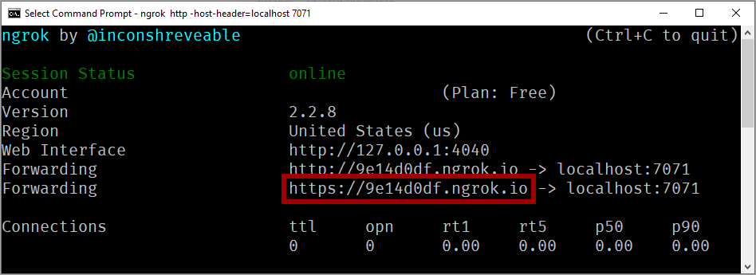

## Allow Azure to call your local function

To break into a function being debugged on your machine, you must enable a way for Azure to communicate with your local function from the cloud.

The [ngrok](https://ngrok.com/) utility provides a way for Azure to call the function running on your machine. Start *ngrok* using the following command:

```bash
ngrok http -host-header=localhost 7071
```
As the utility is set up, the command window should look similar to the following screenshot:



Copy the **HTTPS** URL generated when *ngrok* is run. This value is used when configuring the event grid event endpoint.

## Add a storage event

1. Open the Azure portal and navigate to your storage account and select the **Events** option from the left menu.

    

1. In the *Events* window, select the **Event Subscription** button. 

1. In the *Event Subscription* window, select the *Endpoint Type* dropdown and select **Web Hook**.

    

1. Once the endpoint type is configured, click on **Select an endpoint** to configure the endpoint value.

    

    The *Subscriber Endpoint* value is made up from three different values. The prefix is the HTTPS URL generated by *ngrok*. The  remainder of the URL comes from the URL found in the function code file, with the function name added at the end. Starting with the URL from the function code file, the *ngrok* URL replaces `http://localhost:7071` and the function name replaces `{functionname}`.

1. The following screenshot shows an example of how the final URL should look when using an `Event Grid` trigger type.

    

1. Once you've entered the appropriate value, click **Confirm Selection**.

> [!IMPORTANT]
> Every time you start *ngrok*, the HTTPS URL is regenerated and the value changes. Therefore you must create a new Event Subscription each time you expose your function to Azure via *ngrok*.

## Upload a file

Now you can upload a file to your storage account to trigger an Event Grid event for your local function to handle. 

Open [Storage Explorer](https://azure.microsoft.com/features/storage-explorer/) and connect it to your storage account. 

- Expand **Blob Containers** 
- Right-click and select **Create Blob Container**.
- Name the container **samples-workitems**
- Select the *samples-workitems* container
- Click the **Upload** button
- Click **Upload Files**
- Select a file and upload it to the blob container

