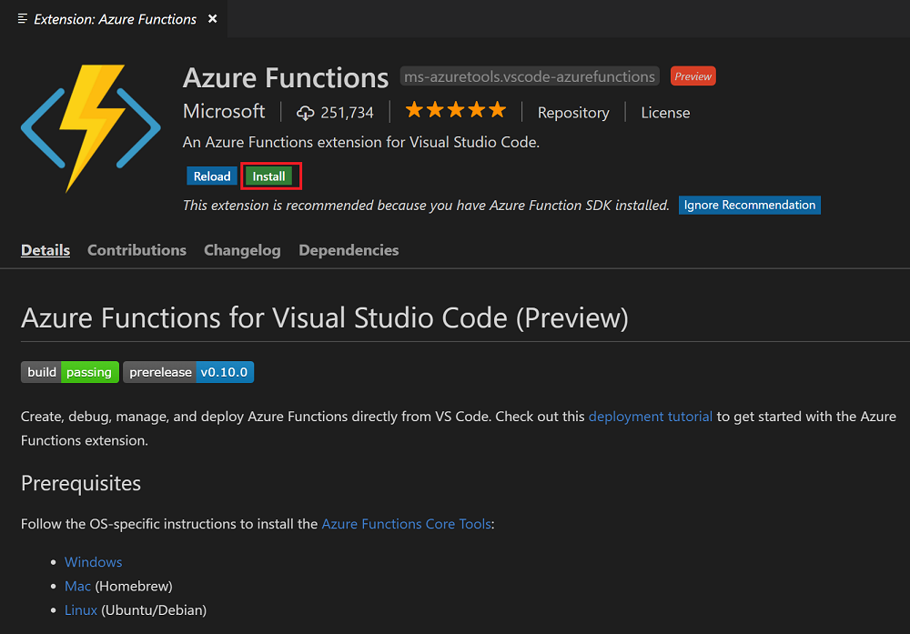
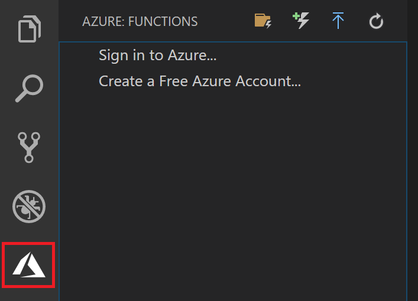

## Install the Azure Function extension

The Azure Functions extension is used to create, test, and deploy functions to Azure.

1. In Visual Studio Code, open **Extensions** and search for `azure functions`, or [open this link in Visual Studio Code](vscode:extension/ms-azuretools.vscode-azurefunctions).

1. Select **Install** to install the extension to Visual Studio Code.

    

1. Restart Visual Studio Code and select the Azure icon on the Activity bar. You should see an Azure Functions area in the Side Bar.

    