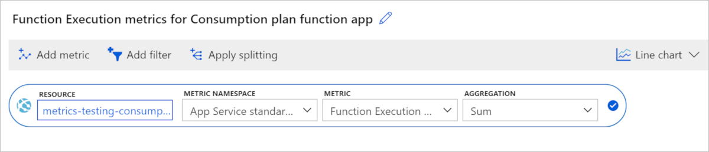

#### [Portal](#tab/portal)

Use [Azure Monitor metrics explorer](../articles/azure-monitor/essentials/metrics-getting-started.md) to view cost-related data for your Consumption plan function apps in a graphical format. 

1. In the [Azure portal], navigate to your function app.

1. In the left panel, scroll down to **Monitoring** and choose **Metrics**.  

1. From **Metric**, choose **Function Execution Count** and **Sum** for **Aggregation**. This adds the sum of the execution counts during chosen period to the chart.

    

1. Select **Add metric** and repeat steps 2-4 to add **Function Execution Units** to the chart. 

The resulting chart contains the totals for both execution metrics in the chosen time range, which in this case is two hours.


As the number of execution units is so much greater than the execution count, the chart just shows execution units.

This chart shows a total of 1.11 billion `Function Execution Units` consumed in a two-hour period, measured in MB-milliseconds. To convert to GB-seconds, divide by 1024000. In this example, the function app consumed `1110000000 / 1024000 = 1083.98` GB-seconds. You can take this value and multiply by the current price of execution time on the [Functions pricing page](https://azure.microsoft.com/pricing/details/functions/), which gives you the cost of these two hours, assuming you've already used any free grants of execution time. 

# [Azure CLI](#tab/azurecli)

The [Azure CLI](/cli/azure/) has commands for retrieving metrics. You can use the CLI from a local command environment or directly from the portal using [Azure Cloud Shell](../articles/cloud-shell/overview.md). For example, the following [az monitor metrics list](/cli/azure/monitor/metrics#az-monitor-metrics-list) command returns hourly data over same time period used before.

Make sure to replace `<AZURE_SUBSCRIPTON_ID>` with your Azure subscription ID running the command.

```azurecli-interactive
az monitor metrics list --resource /subscriptions/<AZURE_SUBSCRIPTION_ID>/resourceGroups/metrics-testing-consumption/providers/Microsoft.Web/sites/metrics-testing-consumption --metric FunctionExecutionUnits,FunctionExecutionCount --aggregation Total --interval PT1H --start-time 2019-09-11T21:46:00Z --end-time 2019-09-11T23:18:00Z
```

This command returns a JSON payload that looks like the following example:

```json
{
  "cost": 0.0,
  "interval": "1:00:00",
  "namespace": "Microsoft.Web/sites",
  "resourceregion": "centralus",
  "timespan": "2019-09-11T21:46:00Z/2019-09-11T23:18:00Z",
  "value": [
    {
      "id": "/subscriptions/XXXXXXX-XXXX-XXXX-XXXX-XXXXXXXXXXX/resourceGroups/metrics-testing-consumption/providers/Microsoft.Web/sites/metrics-testing-consumption/providers/Microsoft.Insights/metrics/FunctionExecutionUnits",
      "name": {
        "localizedValue": "Function Execution Units",
        "value": "FunctionExecutionUnits"
      },
      "resourceGroup": "metrics-testing-consumption",
      "timeseries": [
        {
          "data": [
            {
              "average": null,
              "count": null,
              "maximum": null,
              "minimum": null,
              "timeStamp": "2019-09-11T21:46:00+00:00",
              "total": 793294592.0
            },
            {
              "average": null,
              "count": null,
              "maximum": null,
              "minimum": null,
              "timeStamp": "2019-09-11T22:46:00+00:00",
              "total": 316576256.0
            }
          ],
          "metadatavalues": []
        }
      ],
      "type": "Microsoft.Insights/metrics",
      "unit": "Count"
    },
    {
      "id": "/subscriptions/XXXXXXX-XXXX-XXXX-XXXX-XXXXXXXXXXX/resourceGroups/metrics-testing-consumption/providers/Microsoft.Web/sites/metrics-testing-consumption/providers/Microsoft.Insights/metrics/FunctionExecutionCount",
      "name": {
        "localizedValue": "Function Execution Count",
        "value": "FunctionExecutionCount"
      },
      "resourceGroup": "metrics-testing-consumption",
      "timeseries": [
        {
          "data": [
            {
              "average": null,
              "count": null,
              "maximum": null,
              "minimum": null,
              "timeStamp": "2019-09-11T21:46:00+00:00",
              "total": 33538.0
            },
            {
              "average": null,
              "count": null,
              "maximum": null,
              "minimum": null,
              "timeStamp": "2019-09-11T22:46:00+00:00",
              "total": 13040.0
            }
          ],
          "metadatavalues": []
        }
      ],
      "type": "Microsoft.Insights/metrics",
      "unit": "Count"
    }
  ]
}
```
This particular response shows that from `2019-09-11T21:46` to `2019-09-11T23:18`, the app consumed 1110000000 MB-milliseconds (1083.98 GB-seconds).

# [Azure PowerShell](#tab/azure-powershell) 

The [Azure PowerShell](/powershell/azure/) has commands for retrieving metrics. You can use the Azure PowerShell from a local command environment or directly from the portal using [Azure Cloud Shell](../articles/cloud-shell/overview.md). For example, the following [Get-AzMetric](/powershell/module/az.monitor/get-azmetric) command returns hourly data over same time period used before.

Make sure to replace `<AZURE_SUBSCRIPTON_ID>` with your Azure subscription ID running the command.

```azurepowershell-interactive
Get-AzMetric -ResourceId /subscriptions/<AZURE_SUBSCRIPTION_ID>/resourceGroups/metrics-testing-consumption/providers/Microsoft.Web/sites/metrics-testing-consumption -MetricName  FunctionExecutionUnits,FunctionExecutionCount -AggregationType Total -TimeGrain 01:00:00 -StartTime 2019-09-11T21:46:00Z -EndTime 2019-09-11T23:18:00Z
```

This command returns an output that looks like the following example:

```Output
Id         : /subscriptions/<AZURE_SUBSCRIPTION_ID>/resourceGroups/metrics-testing-consumption/providers/Microsoft.Web/sites/metrics-testing-consumption/providers/Microsoft.Insights/metrics/FunctionExecutionUnits
Name       : 
                LocalizedValue : Function Execution Units
                Value          : FunctionExecutionUnits
             
Type       : Microsoft.Insights/metrics
Unit       : Count
Data       : {Microsoft.Azure.Commands.Insights.OutputClasses.PSMetricValue, 
             Microsoft.Azure.Commands.Insights.OutputClasses.PSMetricValue, 
             Microsoft.Azure.Commands.Insights.OutputClasses.PSMetricValue, 
             Microsoft.Azure.Commands.Insights.OutputClasses.PSMetricValue…}
Timeseries : {Microsoft.Azure.Management.Monitor.Models.TimeSeriesElement}

Id         : /subscriptions/<AZURE_SUBSCRIPTION_ID>/resourceGroups/metrics-testing-consumption/providers/Microsoft.Web/sites/metrics-testing-consumption/providers/Microsoft.Insights/metrics/FunctionExecutionCount
Name       : 
                LocalizedValue : Function Execution Count
                Value          : FunctionExecutionCount
             
Type       : Microsoft.Insights/metrics
Unit       : Count
Data       : {Microsoft.Azure.Commands.Insights.OutputClasses.PSMetricValue, 
             Microsoft.Azure.Commands.Insights.OutputClasses.PSMetricValue, 
             Microsoft.Azure.Commands.Insights.OutputClasses.PSMetricValue, 
             Microsoft.Azure.Commands.Insights.OutputClasses.PSMetricValue…}
Timeseries : {Microsoft.Azure.Management.Monitor.Models.TimeSeriesElement}
```

The `Data` property contains the actual metric values.

---

[Azure portal]: https://portal.azure.com