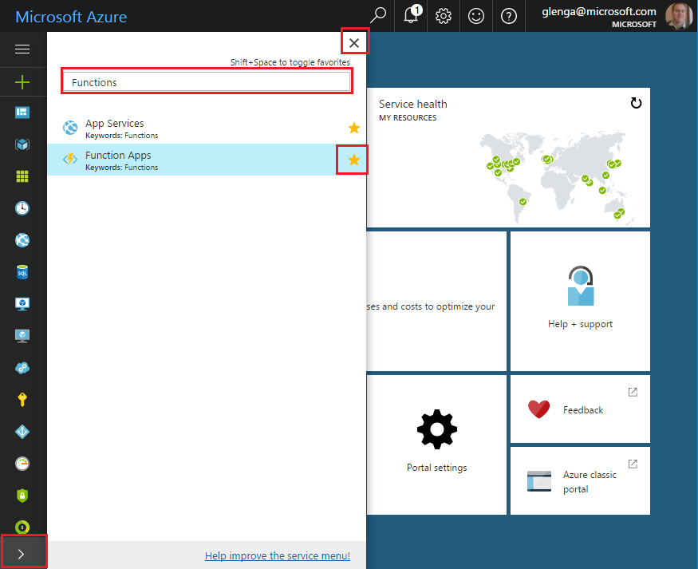

## Add Function Apps to your portal favorites 

If you haven't already done so, add Function Apps to your favorites in the Azure portal. This makes it easier to find your function apps. If you have already done this, skip to the next section. 

1. Log in to the [Azure portal](https://portal.azure.com/).

2. Click the arrow at the bottom left to expand all services, type `Functions` in the **Filter** field, and then click the star next to **Function Apps**.  
 
    

    This adds the Functions icon to the menu on the left of the portal.

3. Close the menu, then scroll down to the bottom to see the Functions icon. Click this icon to see a list of all your function apps. Click your function app to work with functions in this app. 
 
    
 
     