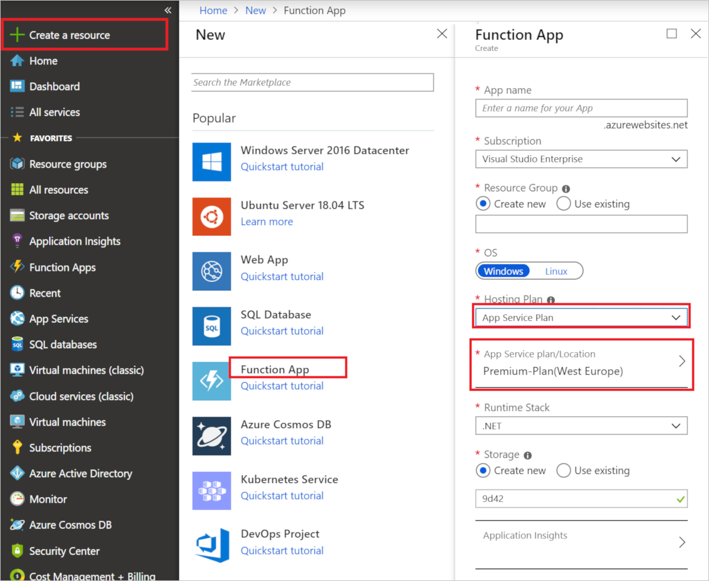
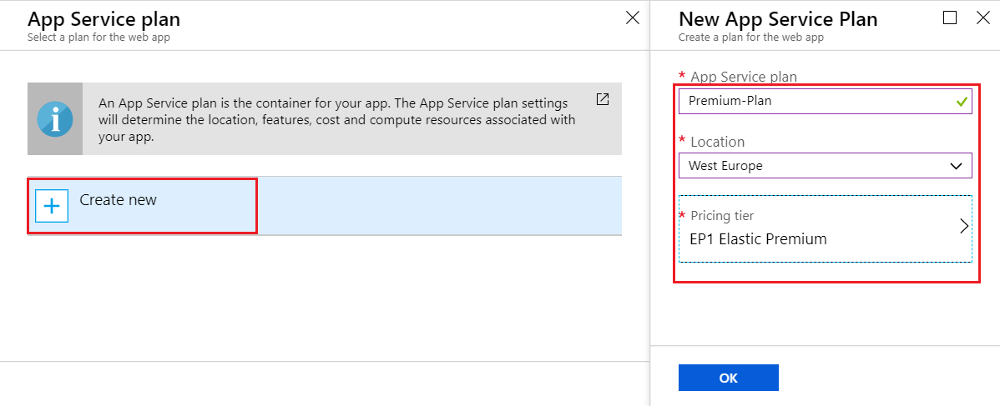
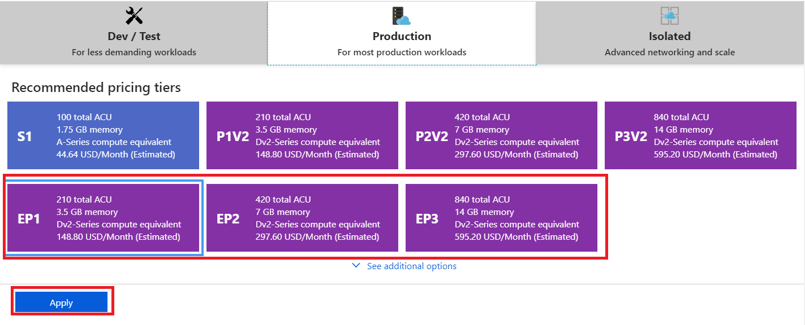

1. Go to the [Azure portal](https://portal.azure.com).

1. Select **+ Create a resource** on the left hand side, then choose **Function app**.

1. For **Hosting plan**, choose **App Service plan**, then select **App Service plan/Location**.

    

1. Select **Create new**, type an **App Service plan** name, choose a **Location** in a [region](https://azure.microsoft.com/regions/) near you or near other services your functions access, and then select **Pricing tier**.

    

1. Choose the **EP1** (elastic Premium) plan, then select **Apply**.

     

1. Select **OK** to create the plan, then use the remaining function app settings as specified in the table below the image. 

      

    | Setting      | Suggested value  | Description                                        |
    | ------------ |  ------- | -------------------------------------------------- |
    | **App name** | Globally unique name | Name that identifies your new function app. Valid characters are `a-z`, `0-9`, and `-`.  | 
    | **Subscription** | Your subscription | The subscription under which this new function app is created. |
    | **[Resource Group](../articles/azure-resource-manager/resource-group-overview.md)** |  myResourceGroup | Name for the new resource group in which to create your function app. You can also use the suggested value. |
    | **OS** | Windows | Linux is not currently supported on the Premium plan. |
    | **Runtime stack** | Preferred language | Choose a runtime that supports your favorite function programming language. Choose **.NET** for C# and F# functions. Only languages supported on your chosen **OS** are displayed. |
    | **[Storage](../articles/storage/common/storage-quickstart-create-account.md)** |  Globally unique name |  Create a storage account used by your function app. Storage account names must be between 3 and 24 characters in length and may contain numbers and lowercase letters only. You can also use an existing account, which must meets the [storage account requirements](../articles/azure-functions/functions-scale.md#storage-account-requirements). |
    | **[Application Insights](../articles/azure-functions/functions-monitoring.md)** | Default | Creates an Application Insights resource of the same *App name* in the nearest supported region. By expanding this setting, you can change the **New resource name** or choose a different **Location** in an [Azure geography](https://azure.microsoft.com/global-infrastructure/geographies/) where you want to store your data. |

1. After your settings are validated, select **Create**.

1. Select the Notification icon in the upper-right corner of the portal and watch for the **Deployment succeeded** message.

    

1. Select **Go to resource** to view your new function app. You can also select **Pin to dashboard**. Pinning makes it easier to return to this function app resource from your dashboard.