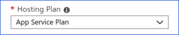

1. Go to the Azure portal.
2. Add a new resource by selecting the **Create a resource** button in the Azure portal.
3. Select **Serverless Function App**.
4. Enter all of your information into the creation settings and set your **Hosting Plan** to **App Service Plan**:
    
      

    1. Select a Premium plan (EP) level for the service plan. 
          

    1. Validate your completed plan settings.  
          
    
1. Validate your app and plan settings, and select **Create**.

      