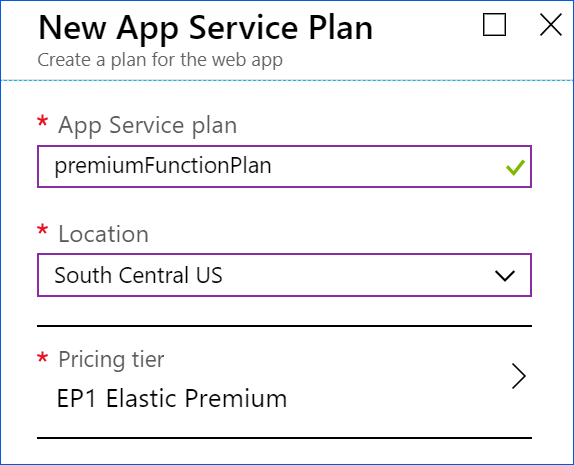

The next step is to create a Function App inside of a Premium plan. The Premium plan is a new offering that brings serverless scale to a plan with all of the benefits of a dedicated App Service Plan. Note that consumption plan Function apps do not support VNET integration.

1. Go to the Azure portal
2. Add a new resource by opening the “Create a resource” blade
3. Select "Serverless Function App"
4. Enter all of your information into the creation blade and set your **Hosting plan** to **App Service Plan**:
    
      

    1. Select a Premium Plan (EP) Service Plan level. 
          

    1. Your completed Plan will look like the following:  
          
    
1. My completed creating blade looked like the following:

      