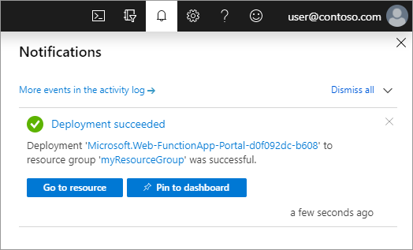

1. From the Azure portal menu or the **Home** page, select **Create a resource**.

1. In the **New** page, select **Compute** > **Function App**.

1. On the **Basics** page, use the function app settings as specified in the following table:

    | Setting      | Suggested value  | Description |
    | ------------ | ---------------- | ----------- |
    | **Subscription** | Your subscription | The subscription under which this new function app is created. |
    | **[Resource Group](../articles/azure-resource-manager/management/overview.md)** |  *myResourceGroup* | Name for the new resource group in which to create your function app. |
    | **Function App name** | Globally unique name | Name that identifies your new function app. Valid characters are `a-z` (case insensitive), `0-9`, and `-`.  |
    |**Publish**| Code | Option to publish code files or a Docker container. |
    | **Runtime stack** | Preferred language | Choose a runtime that supports your favorite function programming language. In-portal editing isn't currently supported for [Python development](../articles/azure-functions/functions-reference-python.md).|
    |**Region**| Preferred region | Choose a [region](https://azure.microsoft.com/regions/) near you or near other services your functions access. |

1. Select **Next: Hosting**. On the **Hosting** page, enter the following settings:

    | Setting      | Suggested value  | Description |
    | ------------ | ---------------- | ----------- |
    | **[Storage account](../articles/storage/common/storage-account-create.md)** |  Globally unique name |  Create a storage account used by your function app. Storage account names must be between 3 and 24 characters in length and may contain numbers and lowercase letters only. You can also use an existing account, which must meet the [storage account requirements](../articles/azure-functions/storage-considerations.md#storage-account-requirements). |
    |**Operating system**| Preferred operating system | An operating system is pre-selected for you based on your runtime stack selection, but you can change the setting if necessary. Python is only supported on Linux. In-portal editing is only supported on Windows.|
    | **[Plan](../articles/azure-functions/functions-scale.md)** | Premium | Hosting plan that defines how resources are allocated to your function app. Select **Premium**. By default, a new App Service plan is created. The default **Sku and size** is **EP1**, where EP stands for _elastic premium_. To learn more, see the [list of Premium SKUs](../articles/azure-functions/functions-premium-plan.md#available-instance-skus). When running JavaScript functions on a Premium plan, you should choose an instance that has fewer vCPUs. For more information, see [Choose single-core Premium plans](../articles/azure-functions/functions-reference-node.md#considerations-for-javascript-functions).  |

1. Select **Next: Monitoring**. On the **Monitoring** page, enter the following settings:

    | Setting      | Suggested value  | Description |
    | ------------ | ---------------- | ----------- |
    | **[Application Insights](../articles/azure-functions/functions-monitoring.md)** | Default | Creates an Application Insights resource of the same *App name* in the nearest supported region. By expanding this setting, you can change the **New resource name** or choose a different **Location** in an [Azure geography](https://azure.microsoft.com/global-infrastructure/geographies/) to store your data. |

1. Select **Review + create** to review the app configuration selections.

1. On the **Review + create** page, review your settings, and then select **Create** to provision and deploy the function app.

1. Select the **Notifications** icon in the upper-right corner of the portal and watch for the **Deployment succeeded** message.

1. Select **Go to resource** to view your new function app. You can also select **Pin to dashboard**. Pinning makes it easier to return to this function app resource from your dashboard.

    
