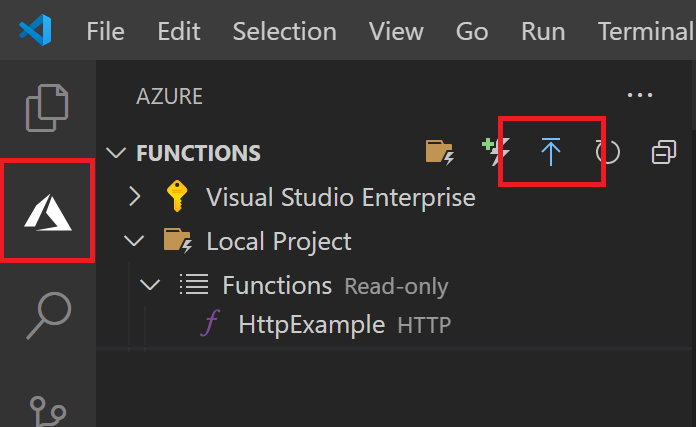
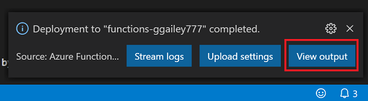

## Publish the project to Azure

In this section, you create a function app and related resources in your Azure subscription and then deploy your code. 

> [!IMPORTANT]
> Publishing to an existing function app overwrites the content of that app in Azure. 

1. Choose the Azure icon in the Activity bar, then in the **Azure: Functions** area, choose the **Deploy to function app...** button.

    

1. Provide the following information at the prompts:

    + **Select folder**: Choose a folder from your workspace or browse to one that contains your function app. You won't see this if you already have a valid function app opened.

    + **Select subscription**: Choose the subscription to use. You won't see this if you only have one subscription.

    + **Select Function App in Azure**: Choose `+ Create new Function App`. (Don't choose the `Advanced` option, which isn't covered in this article.)
      
    + **Enter a globally unique name for the function app**: Type a name that is valid in a URL path. The name you type is validated to make sure that it's unique in Azure Functions. 
    
    ::: zone pivot="programming-language-python"
    + **Select a runtime**: Choose the version of Python you've been running on locally. You can use the `python --version` command to check your version.
    ::: zone-end

    ::: zone pivot="programming-language-javascript,programming-language-typescript"
    + **Select a runtime**: Choose the version of Node.js you've been running on locally. You can use the `node --version` command to check your version.
    ::: zone-end

    + **Select a location for new resources**:  For better performance, choose a [region](https://azure.microsoft.com/regions/) near you. 
    
1.  When completed, the following Azure resources are created in your subscription, using names based on your function app name:
    
    + A resource group, which is a logical container for related resources.
    + A standard Azure Storage account, which maintains state and other information about your projects.
    + A consumption plan, which defines the underlying host for your serverless function app. 
    + A function app, which provides the environment for executing your function code. A function app lets you group functions as a logical unit for easier management, deployment, and sharing of resources within the same hosting plan.
    + An Application Insights instance connected to the function app, which tracks usage of your serverless function.

    A notification is displayed after your function app is created and the deployment package is applied. 
    
1. Select **View Output** in this notification to view the creation and deployment results, including the Azure resources that you created. If you miss the notification, select the bell icon in the lower right corner to see it again.

    
