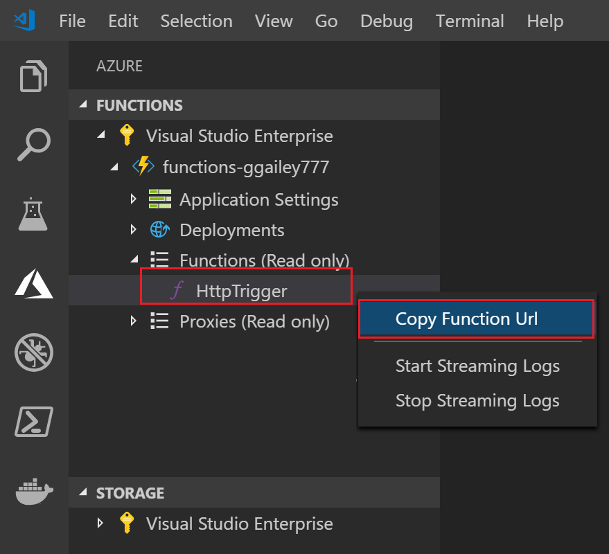

## Publish the project to Azure

Visual Studio Code lets you publish your functions project directly to Azure. In the process, you create a function app and related resources in your Azure subscription. The function app provides an execution context for your functions. The project is packaged and deployed to the new function app in your Azure subscription.

By default, Visual Studio Code creates all of the Azure resources required to create your function app. The names of these resources are based on the function app name you choose. If you need to have full control of the created resources, you can instead [publish using advanced options](../articles/azure-functions/functions-develop-vs-code.md#enable-publishing-with-advanced-create-options).

This section assumes that you are creating a new function app in Azure.

> [!IMPORTANT]
> Publishing to an existing function app overwrites the content of that app in Azure.

1. In Visual Studio Code, press F1 to open the command palette. In the command palette, search for and select `Azure Functions: Deploy to function app...`.

1. If not signed-in, you are prompted to **Sign in to Azure**. You can also **Create a free Azure account**. After successful sign in from the browser, go back to Visual Studio Code. 

1. If you have multiple subscriptions, **Select a subscription** for the function app, then choose **+ Create New Function App in Azure**.

1. Type a globally unique name that identifies your function app and press Enter. Valid characters for a function app name are `a-z`, `0-9`, and `-`.

    When you press Enter, the following Azure resources are created in your subscription:

    * **[Resource group](../articles/azure-resource-manager/management/overview.md)**: Contains all of the created Azure resources. The name is based on your function app name.
    * **[Storage account](../articles/storage/common/storage-account-create.md)**: A standard Storage account is created with a unique name that is based on your function app name.
    * **[Hosting plan](../articles/azure-functions/functions-scale.md)**: A consumption plan is created in the West US region to host your serverless function app.
    * **Function app**: Your project is deployed to and runs in this new function app.

    A notification is displayed after your function app is created and the deployment package is applied. Select **View Output** in this notification to view the creation and deployment results, including the Azure resources that you created.

1. Back in the **Azure: Functions** area, expand the new function app under your subscription. Expand **Functions**, right-click **HttpTrigger**, and then choose **Copy function URL**.

    
