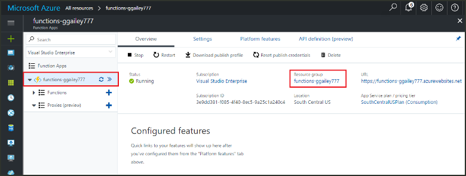

Other quick starts in this collection build upon this quick start. If you plan to work with subsequent quick starts, tutorials, or with any of the services you have created in this quick start, do not clean up the resources.

*Resources* in Azure refers to function apps, functions, storage accounts, and so forth. They are grouped into *resource groups*, and you can delete everything in a group by deleting the group. 

You created resources to complete these quickstarts. You may be billed for these resources, depending on your [account status](https://azure.microsoft.com/account/) and [service pricing](https://azure.microsoft.com/pricing/). If you don't need the resources anymore, here's how to delete them:

1. In the Azure portal, go to the **Resource group** page. 

   To get to that page from the function app page, select the **Overview** tab and then select the link under **Resource group**.

   

   To get to that page from the dashboard, select **Resource groups**, and then select the resource group that you used for this quickstart.

2. In the **Resource group** page, review the list of included resources, and verify that they are the ones you want to delete.
 
3. Select **Delete resource group**, and follow the instructions.

   Deletion may take a couple of minutes. When it's done, a notification appears for a few seconds. You can also select the bell icon at the top of the page to view the notification.
