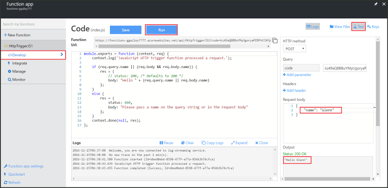
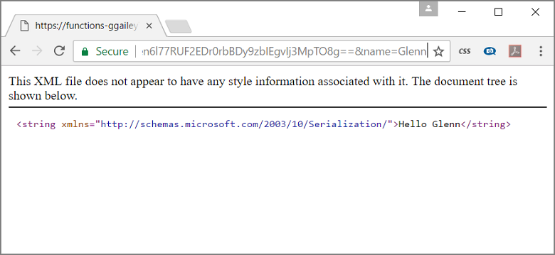

Since the Azure Functions quickstarts contain functional code, you can immediately test your new function.

1. In the **Develop** tab, review the **Code** window and notice that the provided code expects an HTTP request with a *name* value passed either in the message body or in a query string. When the function runs, this value is returned in the response message. The example shown below is a JavaScript function.
   
2. Click **Test** to display the built-in HTTP test request pane for the function.
 
    

3. In the **Request body** text box, change the value of the *name* property to your name, and click **Run**. You see that execution is triggered by a test HTTP request, information is written to the logs, and the "hello..." response is displayed in the **Output**. 

4. To trigger execution of the same function from an HTTP testing tool or from another browser window, copy the **Function URL** value from the **Develop** tab and paste it into the tool or browser address bar. Append the query string value `&name=yourname` to the URL and execute the request. Note that the same information is written to the logs and the same string is contained in the body of the response message.

	
