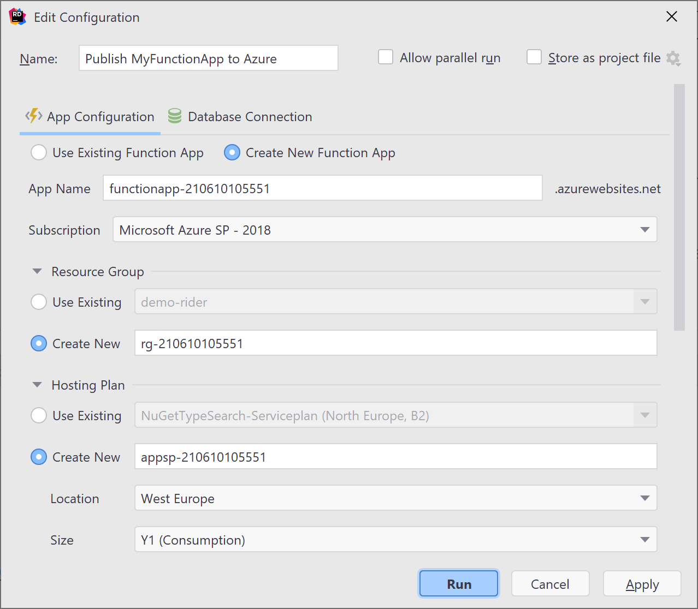
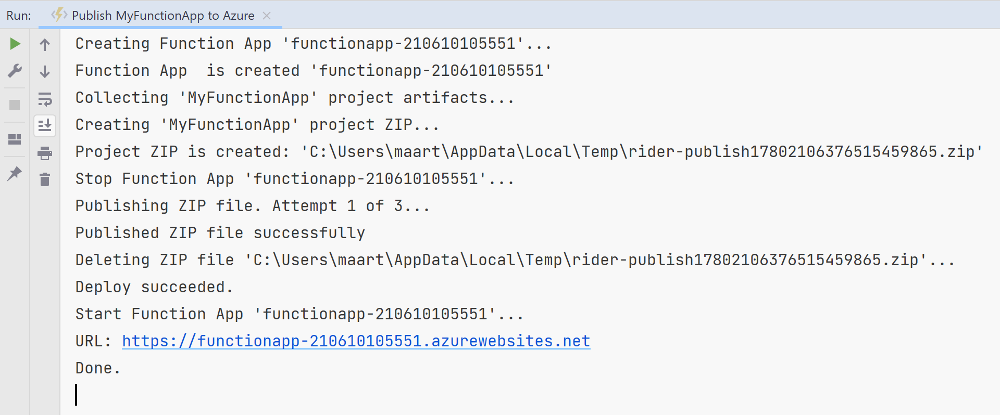

1. In **Solution Explorer**, right-click the project and select **Publish** and in **Publish To**, select **Azure...**

1. In **App Configuration**, choose **Create New Function App** .

1. Create a new function instance using the values specified in the following table:

    | Setting      | Value  | Description                                |
    | ------------ |  ------- | -------------------------------------------------- |
    | **App Name** | Globally unique name | Name that uniquely identifies your new function app. Accept this name or enter a new name. Valid characters are: `a-z`, `0-9`, and `-`. |
    | **Subscription** | Your subscription | The Azure subscription to use. Accept this subscription or select a new one from the drop-down list. |
    | **[Resource group](../articles/azure-resource-manager/management/overview.md)** | Name of your resource group |  The resource group in which to create your function app. Select an existing resource group from the drop-down list or choose **Create New** to create a new resource group. |
    | **Hosting Plan** | Your hosting plan | The hosting plan in which to create your function app. Select an existing hosting plan from the drop-down list or choose **Create New** to create a new hosting plan. |
    | **Location** | Location of the app service | Choose a **Location** in a [region](https://azure.microsoft.com/regions/) near you or other services your functions access. |
    | **[Plan Size](../articles/azure-functions/functions-scale.md)** | Y1 (Consumption) | When you publish your project to a function app that runs in a [Consumption plan](../articles/azure-functions/consumption-plan.md), you pay only for executions of your functions app. Other hosting plans incur higher costs. |

    

1. Select **Run** to create a function app and its related resources in Azure, and deploy your application to it. 

    After the deployment completes the root URL of the function app in Azure is shown in the **Run** tool window.

    