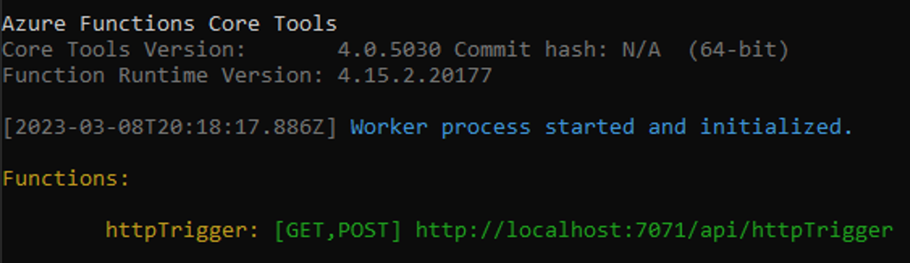

## Run the function locally

1. Run your function by starting the local Azure Functions runtime host from the *LocalFunctionProj* folder.

    ```console
    func start
    ```

    Toward the end of the output, the following lines must appear:

    
    
    >[!NOTE]  
    > If HttpExample doesn't appear as shown above, you likely started the host from outside the root folder of the project. In that case, use **Ctrl**+**C** to stop the host, go to the project's root folder, and run the previous command again.

1. Copy the URL of your HTTP function from this output to a browser and append the query string `?name=<YOUR_NAME>`, making the full URL like `http://localhost:7071/api/HttpExample?name=Functions`. The browser should display a response message that echoes back your query string value. The terminal in which you started your project also shows log output as you make requests.

1. When you're done, press <kbd>Ctrl + C</kbd> and type `y` to stop the functions host.
