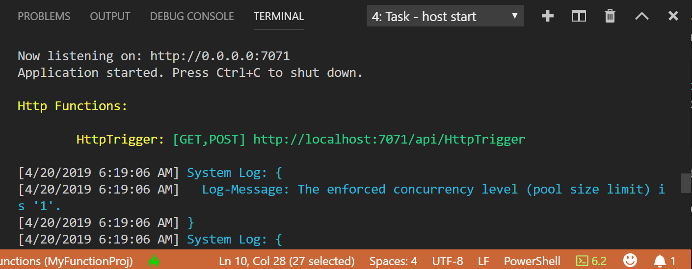

## Run the function locally

Azure Functions Core Tools integrates with Visual Studio Code to let you run and debug an Azure Functions project locally.  

1. To debug your function, insert a call to the [`Wait-Debugger`](/powershell/module/microsoft.powershell.utility/wait-debugger?view=powershell-6) cmdlet in the function code before you want to attach the debugger, then press F5 to start the function app project and attach the debugger. Output from Core Tools is displayed in the **Terminal** panel.

1. In the **Terminal** panel, copy the URL endpoint of your HTTP-triggered function.

    

1. Append the query string `?name=<yourname>` to this URL, and then use `Invoke-RestMethod` in a second PowerShell command prompt to execute the request, as follows:

    ```powershell
    PS > Invoke-RestMethod -Method Get -Uri http://localhost:7071/api/HttpTrigger?name=PowerShell
    Hello PowerShell
    ```

    You can also execute the GET request from a browser from the following URL:

    <http://localhost:7071/api/HttpExample?name=PowerShell>

    When you call the HttpTrigger endpoint without passing a `name` parameter either as a query parameter or in the body, the function returns a `BadRequest` error. When you review the code in run.ps1, you see that this error occurs by design.

1. Information about the request is shown in **Terminal** panel.

    

1. To stop debugging, press Ctrl + C to stop Core Tools.

After you've verified that the function runs correctly on your local computer, it's time to publish the project to Azure.

> [!NOTE]
> Remember to remove any calls to `Wait-Debugger` before you publish your functions to Azure. 