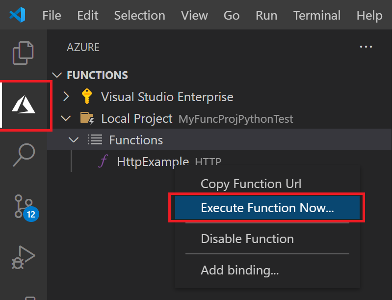

## Run the function locally

Visual Studio Code integrates with [Azure Functions Core tools](../articles/azure-functions/functions-run-local.md) to let you run this project on your local development computer before you publish to Azure.

1. To start the function locally, press <kbd>F5</kbd> or the play icon. Output from Core Tools is displayed in the **Terminal** panel. You can see the URL endpoint of your HTTP-triggered function running locally.

    

    If you have trouble running on Windows, make sure that the default terminal for Visual Studio Code isn't set to **WSL Bash**.

1. With the function still running, choose the Azure icon in the activity bar. In the **Workspace** area, expand **Local Project** > **Functions**. Right-click (Windows) or <kbd>Ctrl -</kbd> click (macOS) the `HttpExample` function and choose **Execute Function Now...**.

    

2. In **Enter request body** you see the request message body value of `{ "name": "Azure" }`. Press Enter to send this request message to your function.

3. When the function executes locally and returns a response, a notification is raised in Visual Studio Code. Information about the function execution is shown in **Terminal** panel.

4. With the **Terminal** panel focused, press <kbd>Ctrl + C</kbd> to stop Core Tools and disconnect the debugger.
