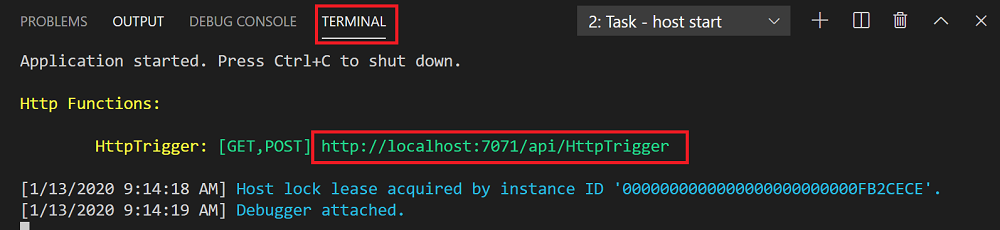
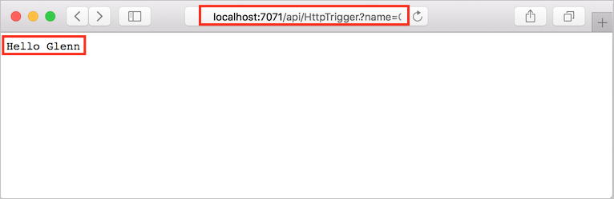
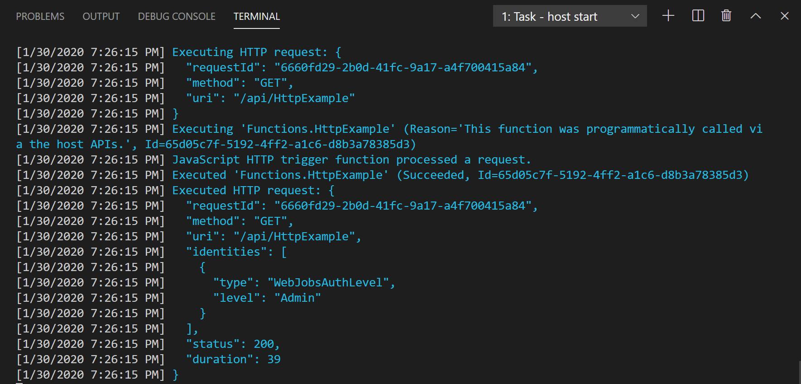

## Run the function locally

Visual Studio Code integrates with [Azure Functions Core Tools](../articles/azure-functions/functions-run-local.md) to let you run this project on your local development computer before you publish to Azure.

1. To call your function, press F5 to start the function app project. Output from Core Tools is displayed in the **Terminal** panel.

1. If you haven't already installed Azure Functions Core Tools, select **Install** at the prompt. When the Core Tools are installed, your app starts in the **Terminal** panel. You can see the URL endpoint of your HTTP-triggered function running locally. 

    

1. With Core Tools running, navigate to the following URL to execute a GET request, which includes `?name=Functions` query string.

    <http://localhost:7071/api/HttpExample?name=Functions>

1. A response is returned, which looks like the following in a browser:

    

1. Information about the request is shown in **Terminal** panel.

    

1. Press Ctrl + C to stop Core Tools and disconnect the debugger.
