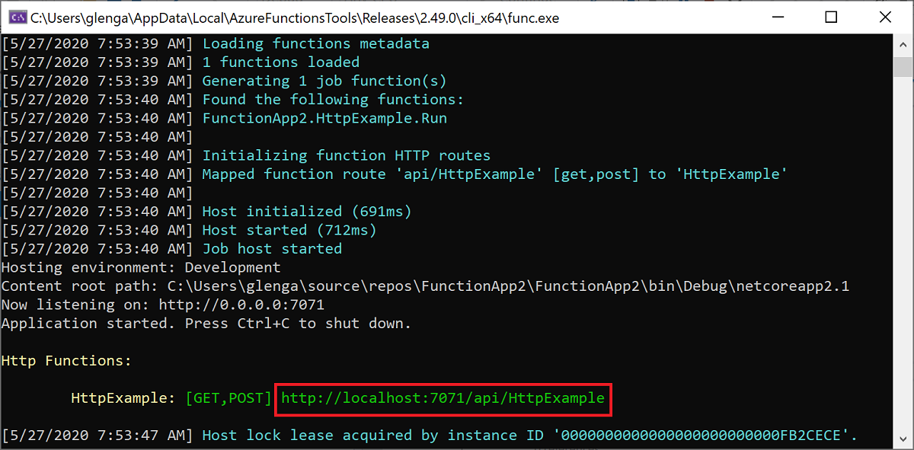
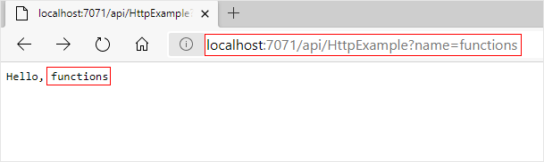

1. To run your function, press <kbd>F5</kbd> in Visual Studio. You might need to enable a firewall exception so that the tools can handle HTTP requests. Authorization levels are never enforced when you run a function locally.

2. Copy the URL of your function from the Azure Functions runtime output.

    

3. Paste the URL for the HTTP request into your browser's address bar. Append the query string `?name=<YOUR_NAME>` to this URL and run the request. The following image shows the response in the browser to the local GET request returned by the function: 

    

4. To stop debugging, press <kbd>Shift</kbd>+<kbd>F5</kbd> in Visual Studio.
