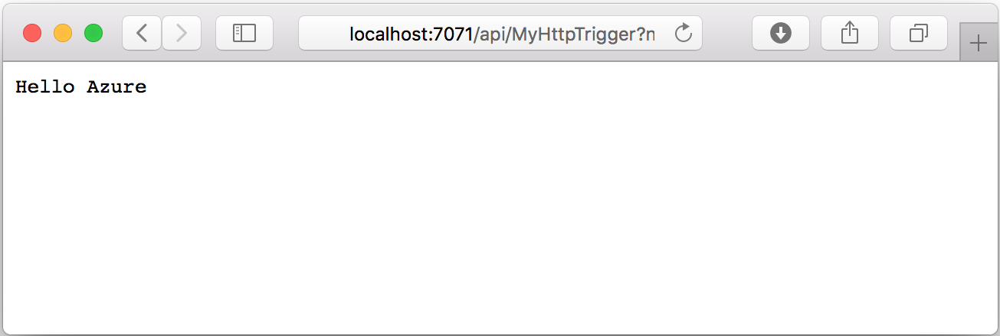

## Run the function locally

The following command starts the function app. The app runs using the same Azure Functions runtime that is in Azure. The start command varies, depending on your project language.

### C\#

```command
func start --build
```

### JavaScript

```command
func start
```

### TypeScript

```command
npm install
npm start     
```

When the Functions host starts, it writes something like the following output, which has been truncated for readability:

```output

                  %%%%%%
                 %%%%%%
            @   %%%%%%    @
          @@   %%%%%%      @@
       @@@    %%%%%%%%%%%    @@@
     @@      %%%%%%%%%%        @@
       @@         %%%%       @@
         @@      %%%       @@
           @@    %%      @@
                %%
                %

...

Content root path: C:\functions\MyFunctionProj
Now listening on: http://0.0.0.0:7071
Application started. Press Ctrl+C to shut down.

...

Http Functions:

        HttpTrigger: http://localhost:7071/api/MyHttpTrigger

[8/27/2018 10:38:27 PM] Host started (29486ms)
[8/27/2018 10:38:27 PM] Job host started
```

Copy the URL of your `HttpTrigger` function from the runtime output and paste it into your browser's address bar. Append the query string `?name=<yourname>` to this URL and execute the request. The following shows the response in the browser to the GET request returned by the local function:



Now that you have run your function locally, you can create the function app and other required resources in Azure.
