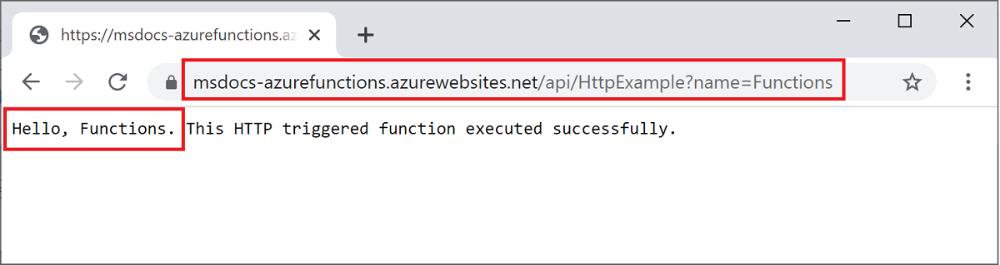
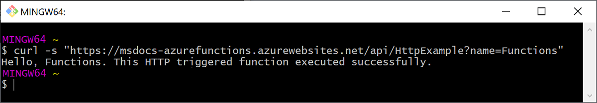

## Invoke the function on Azure

Because your function uses an HTTP trigger, you invoke it by making an HTTP request to its URL in the browser or with a tool like curl. 

# [Browser](#tab/browser)

Copy the complete **Invoke URL** shown in the output of the publish command into a browser address bar, appending the query parameter `?name=Functions`. The browser should display similar output as when you ran the function locally.

# [curl](#tab/curl)

Run [`curl`](https://curl.haxx.se/) with the **Invoke URL**, appending the parameter `?name=Functions`. The output of the command should be the text, "Hello Functions."

---
