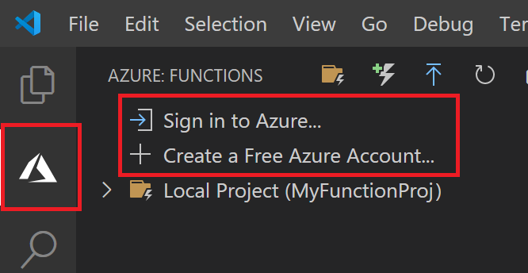

## Sign in to Azure

Before you can publish your app, you must sign in to Azure. 

1. If you aren't already signed in, choose the Azure icon in the Activity bar, then in the **Azure: Functions** area, choose **Sign in to Azure...**. If you don't already have one, you can **[Create a free Azure account](https://azure.microsoft.com/free/)**. Students can click here to **[Create a free Azure for Students account](https://azure.microsoft.com/free/students/)**

    

    If you're already signed in, go to the next section.

1. When prompted in the browser, choose your Azure account and sign in using your Azure account credentials. 

1. After you've successfully signed in, you can close the new browser window. The subscriptions that belong to your Azure account are  displayed in the Side bar.
