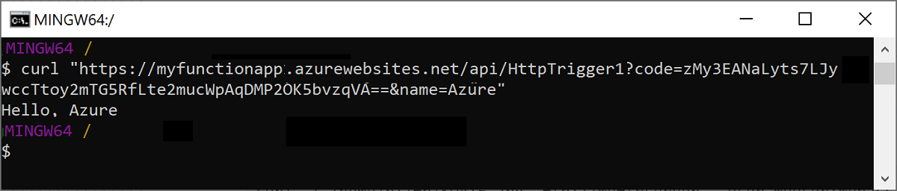
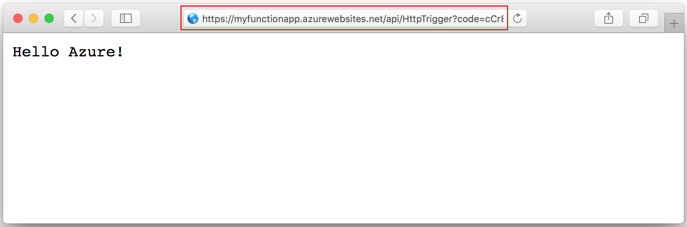

## <a name="test"></a>Test the function in Azure

Use cURL to test the deployed function. Using the URL that you copied from the previous step, append the query string `&name=<yourname>` to the URL, as in the following example:

```bash
curl https://myfunctionapp.azurewebsites.net/api/httptrigger?code=cCr8sAxfBiow548FBDLS1....&name=<yourname>
```

 

You can also paste the copied URL in to the address of your web browser. Again, append the query string `&name=<yourname>` to the URL before you execute the request.

  
