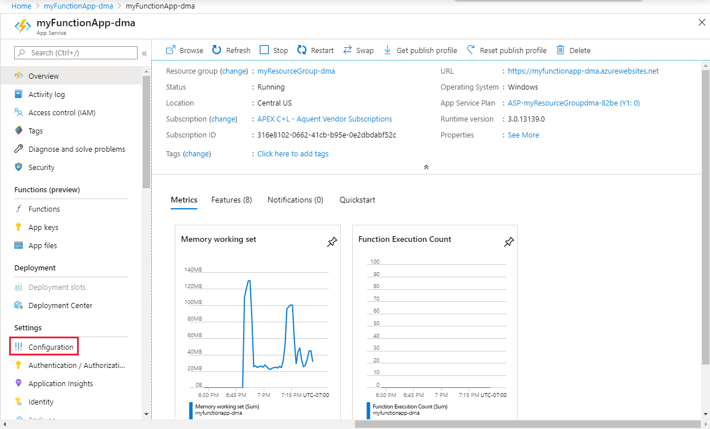
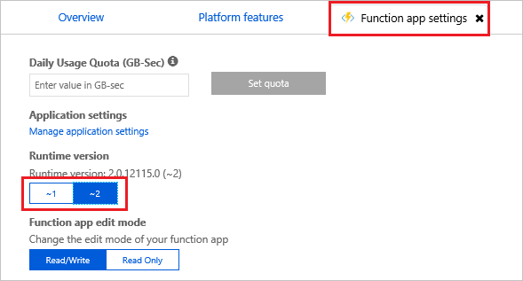

Use the following procedure to view and update the runtime version currently used by a function app.

1. In the [Azure portal](https://portal.azure.com), browse to your function app.

1. Under **Configured Features**, choose **Function app settings**.

    

1. In the **Function app settings** tab, locate the **Runtime version**. Note the specific runtime version and the requested major version. In the example below, the version is set to `~2`.

   

1. To pin your function app to the version 1.x runtime, choose **~1** under **Runtime version**. This switch is disabled when you have functions in your app.

1. When you change the runtime version, go back to the **Overview** tab and choose **Restart** to restart the app.  The function app restarts running on the version 1.x runtime, and the version 1.x templates are used when you create functions.