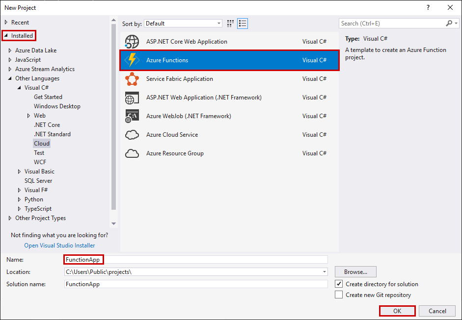
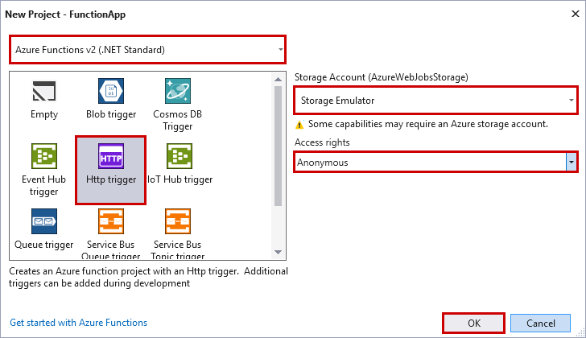

The Azure Functions project template in Visual Studio creates a project that can be published to a function app in Azure. You can use a function app to group functions as a logical unit for management, deployment, and sharing of resources.

1. In Visual Studio, on the **File** menu, select **New** > **Project**.

2. In the **New Project** dialog box, select **Installed** > **Visual C#** > **Cloud** > **Azure Functions**. Enter a name for your project, and select **OK**. The function app name must be valid as a C# namespace, so don't use underscores, hyphens, or any other nonalphanumeric characters.

    

3. Use the settings specified in the table that follows the image.

     

    | Setting      | Suggested value  | Description                      |
    | ------------ |  ------- |----------------------------------------- |
    | **Version** | Azure Functions 2.x  (.NET Core) | This setting creates a function project that uses the version 2.x runtime of Azure Functions, which supports .NET Core. Azure Functions 1.x supports the .NET Framework. For more information, see [Target Azure Functions runtime version](../articles/azure-functions/functions-versions.md).   |
    | **Template** | HTTP trigger | This setting creates a function triggered by an HTTP request. |
    | **Storage account**  | Storage emulator | An HTTP trigger doesn't use the Azure Storage account connection. All other trigger types require a valid Storage account connection string. |
    | **Access rights** | Anonymous | The created function can be triggered by any client without providing a key. This authorization setting makes it easy to test your new function. For more information about keys and authorization, see [Authorization keys](../articles/azure-functions/functions-bindings-http-webhook.md#authorization-keys) in the [HTTP and webhook bindings](../articles/azure-functions/functions-bindings-http-webhook.md). |
    
    > [!NOTE]
    > Make sure you set the **Access rights** to `Anonymous`. If you choose the default level of `Function`, you're required to present the [function key](../articles/azure-functions/functions-bindings-http-webhook.md#authorization-keys) in requests to access your function endpoint.
    
4. Select **OK** to create the function project and HTTP-triggered function.
