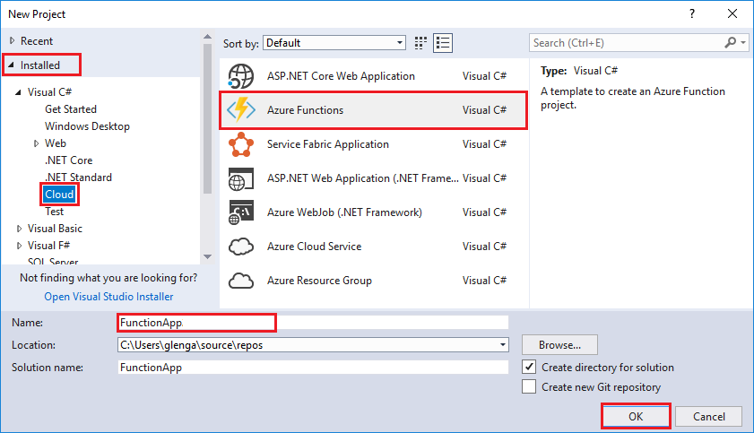

The Azure Functions project template in Visual Studio creates a project that can be published to a function app in Azure. A function app lets you group functions as a logic unit for easier management, deployment, and sharing of resources.   

Right mouse click on the project node in **Solution Explorer**, then choose **Add** > **New Item**. Choose **Azure Function** from the dialog box.

In the **New Project** dialog, expand **Visual C#** > **Cloud** node, select **Azure Functions**, type a **Name** for your project, and click **OK**. The function app name must be valid as a C# namespace, so don't use underscores, hyphens, or any other nonalphanumeric characters. 

