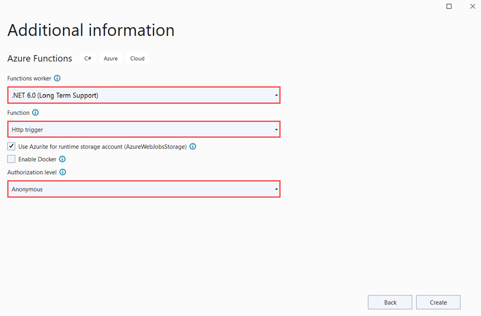

The Azure Functions project template in Visual Studio creates a project that you can publish to a function app in Azure. You can use a function app to group functions as a logical unit for easier management, deployment, scaling, and sharing of resources.

1. In Visual Studio, on the **File** menu, select **New** > **Project**.

1. In **Create a new project**, enter *functions* in the search box, and then choose the **Azure Functions** template.

1. In **Configure your new project**, enter a **Project name** for your project, and then select **Create**. The function app name must be valid as a C# namespace, so don't use underscores, hyphens, or any other nonalphanumeric characters.

1. For the **New Project - &lt;your project name&gt;** settings, use the values in the following table:

    | Setting      | Value  | Description                      |
    | ------------ |  ------- |----------------------------------------- |
    | **Functions runtime** | **Azure Functions v2  (.NET Core)** | This value creates a function project that uses the version 2.x runtime of Azure Functions, which supports .NET Core. Azure Functions 1.x supports the .NET Framework. For more information, see [Azure Functions runtime versions overview](../articles/azure-functions/functions-versions.md).   |
    | **Function template** | **HTTP trigger** | This value creates a function triggered by an HTTP request. |
    | **Storage Account**  | **Storage Emulator** | Because an Azure Function requires a storage account, one is assigned or created when you publish your project to Azure. An HTTP trigger doesn't use an Azure Storage account connection string; all other trigger types require a valid Azure Storage account connection string.  |
    | **Access rights** | **Anonymous** | The created function can be triggered by any client without providing a key. This authorization setting makes it easy to test your new function. For more information about keys and authorization, see [Authorization keys](../articles/azure-functions/functions-bindings-http-webhook-trigger.md#authorization-keys) and [HTTP and webhook bindings](../articles/azure-functions/functions-bindings-http-webhook.md). |
    

    
    

    Make sure you set the **Access rights** to **Anonymous**. If you choose the default level of **Function**, you're required to present the [function key](../articles/azure-functions/functions-bindings-http-webhook-trigger.md#authorization-keys) in requests to access your function endpoint.

1. Select **OK** to create the function project and HTTP-triggered function.
