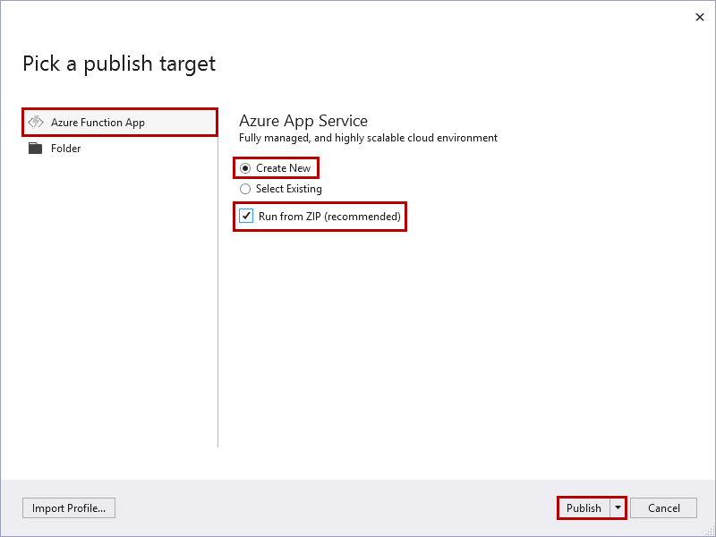

1. In **Solution Explorer**, right-click the project and select **Publish**.

2. In the **Pick a publish target** dialog, use the publish options as specified in the table below the image: 

    

    | Option      | Description                                |
    | ------------ |  -------------------------------------------------- |
    | **Azure Functions Consumption plan** |   When you publish your project to a function app that runs in a [Consumption plan](../articles/azure-functions/functions-scale.md#consumption-plan), you only pay for executions of your functions app. Other hosting plans incur higher costs. To learn more, see [Azure Functions scale and hosting](../articles/azure-functions/functions-scale.md). | 
    | **Create new** | A new function app, with related resources, is created in Azure. When you choose **Select Existing**, all files in the existing function app in Azure are overwritten by files from the local project. Only use this option when republishing updates to an existing function app. |
    | **Run from package file** | Your function app is deployed using [Zip Deploy](../articles/azure-functions/functions-deployment-technologies.md#zip-deploy) with [Run-From-Package](../articles/azure-functions/run-functions-from-deployment-package.md) mode enabled. This is the recommended way of running your functions, which results in better performance. When not using this option, make sure to stop your function app project from running locally before you publish to Azure. |

3. Select **Publish**. If you haven't already signed-in to your Azure account from Visual Studio, select **Sign-in**. You can also create a free Azure account.

4. In the **Azure App Service: Create new** dialog, use the **Hosting** settings as specified in the table below the image:

    

    | Setting      | Suggested value  | Description                                |
    | ------------ |  ------- | -------------------------------------------------- |
    | **Name** | Globally unique name | Name that uniquely identifies your new function app. Valid characters are `a-z`, `0-9`, and `-`. |
    | **Subscription** | Choose your subscription | The Azure subscription to use. |
    | **[Resource Group](../articles/azure-resource-manager/management/overview.md)** | myResourceGroup |  Name of the resource group in which to create your function app. Choose **New** to create a new resource group.|
    | **[Hosting Plan](../articles/azure-functions/functions-scale.md)** | Consumption plan | Make sure to choose the **Consumption** under **Size** after you select **New** to create a serverless plan. Also, choose a **Location** in a [region](https://azure.microsoft.com/regions/) near you or near other services your functions access. When you run in a plan other than **Consumption**, you must manage the [scaling of your function app](../articles/azure-functions/functions-scale.md).  |
    | **[Azure Storage](../articles/storage/common/storage-account-create.md)** | General-purpose storage account | An Azure storage account is required by the Functions runtime. Select **New** to create a general-purpose storage account. You can also use an existing account that meets the [storage account requirements](../articles/azure-functions/functions-scale.md#storage-account-requirements).  |

5. Select **Create** to create a function app and related resources in Azure with these settings and deploy your function project code. 

6. After the deployment is complete, make a note of the **Site URL** value, which is the address of your function app in Azure.

    
