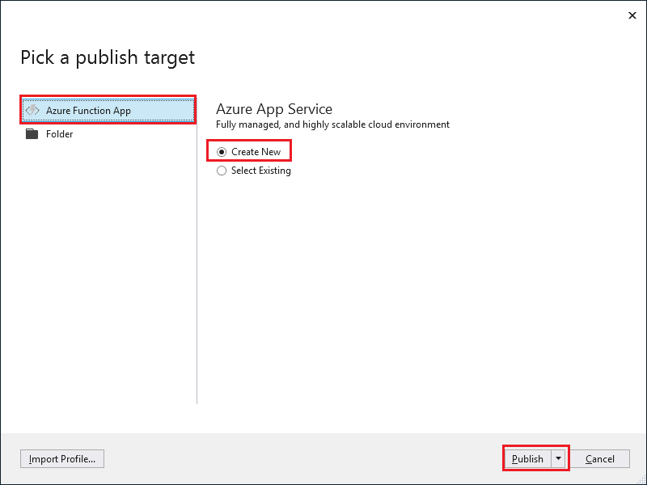
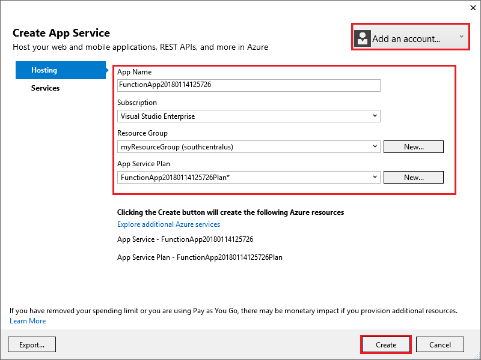
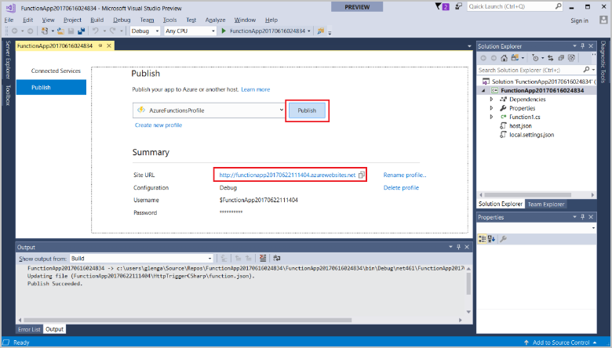

1. In **Solution Explorer**, right-click the project and select **Publish**.

2. Select **Azure Function App**, choose **Create New**, and then select **Publish**.

    

    When you enable **Run from Zip**, your function app in Azure is run directly from the deployment package. For more information, see [Run your Azure Functions from a package file](../articles/azure-functions/run-functions-from-deployment-package.md).

3. If you haven't already connected Visual Studio to your Azure account, select **Add an account...**.

4. In the **Create App Service** dialog, use the **Hosting** settings as specified in the table below the image:

    

    | Setting      | Suggested value  | Description                                |
    | ------------ |  ------- | -------------------------------------------------- |
    | **App Name** | Globally unique name | Name that uniquely identifies your new function app. |
    | **Subscription** | Choose your subscription | The Azure subscription to use. |
    | **[Resource Group](../articles/azure-resource-manager/resource-group-overview.md)** | myResourceGroup |  Name of the resource group in which to create your function app. Choose **New** to create a new resource group.|
    | **[App Service Plan](../articles/azure-functions/functions-scale.md)** | Consumption plan | Make sure to choose the **Consumption** under **Size** after you click **New** to create a serverless plan. Also, choose a **Location** in a [region](https://azure.microsoft.com/regions/) near you or near other services your functions access. When you run in a plan other than **Consumption**, you must manage the [scaling of your function app](../articles/azure-functions/functions-scale.md).  |
    | **[Storage Account](../articles/storage/common/storage-quickstart-create-account.md)** | General purpose storage account | An Azure storage account is required by the Functions runtime. Click **New** to create a general purpose storage account. You can also use an existing account that meets the [storage account requirements](../articles/azure-functions/functions-scale.md#storage-account-requirements).  |

5. Click **Create** to create a function app and related resources in Azure with these settings and deploy your function project code. 

6. After the deployment is complete, make a note of the **Site URL** value, which is the address of your function app in Azure.

    
