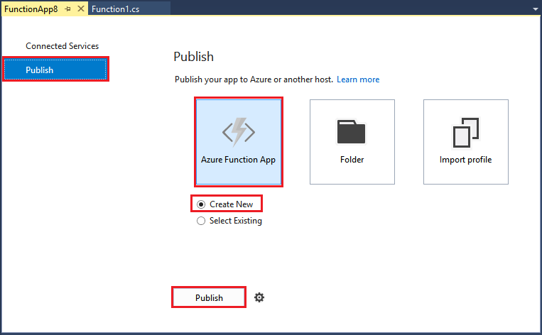

In **Solution Explorer**, right-click the project and select **Publish**. Choose **Create New**  and then click **Publish**. 

If you haven't already connected Visual Studio to your Azure account, click **Add an account...**.  

In the **Create App Service** dialog, use the hosting settings as specified in the table. 

| Setting      | Suggested value  | Description                                |
| ------------ |  ------- | -------------------------------------------------- |
| **App Name** | Globally unique name | Name that uniquely identifies your new function app. |
| **Subscription** | Choose your subscription | The Azure subscription to use. |
| **[Resource Group](../articles/azure-resource-manager/resource-group-overview.md)** | myResourceGroup |  Name of the resource group in which to create your function app. |
| **[App Service Plan](../articles/azure-functions/functions-scale.md)** | Consumption plan | Make sure to choose the **Consumption** under **Size** when you create a new plan.  |
| **[Storage account](../articles/storage/storage-create-storage-account.md#create-a-storage-account)** | Globally unique name | Use an existing storage account or create a new one.   |

Click **Create** to create a function app in Azure with these settings. 

After the provisioning is complete, click **Publish** to deploy your project code to the new function app. 

Make a note of the **Site URL** value, which is the address of your function app in Azure. 