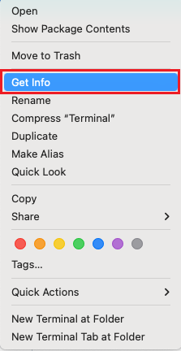
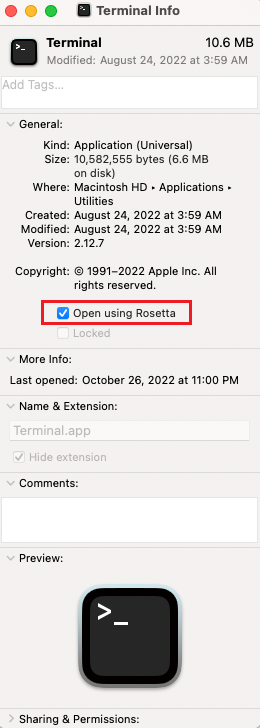

## x86 emulation on ARM64

Functions doesn't currently support local Python function development on ARM64 devices. Use the following steps to develop Python functions on a Mac with an M1 chip by running in an emulated x86 environment. 

### Enable Rosetta in Terminal

1. In your Mac, open Finder, choose **Applications**, and locate **Terminal**.

1. Control-click **Terminal** and select **Get Info**. You can also create a separate parallel environment by duplicating the Terminal and renaming it.

    

1. Select **Open using Rosetta**.

    

1. Open Terminal, which now has Rosetta enabled, and make sure your shell is zsh.

1. Run the following command to validate the x86 emulation.

    ```cmd
    $ arch
    ```

    A response of `i386` indicates your terminal is running an x86 emulated environment. If you aren't yet running in an x86 emulated environment, you may need to restart your local computer. 

### Install required packages 
 
Reinstall all dependencies required by Functions in this environment, which includes the following packages: 

* [homebrew](https://brew.sh/), installed to the path `/usr/local/bin/brew`.
* Python 
* [Azure Functions Core Tools](../articles/azure-functions/functions-run-local.md#install-the-azure-functions-core-tools)

Also, reinstall any other packages required by your Python project.

### Set aliases (optional)

You can optionally set aliases to make it easy to reference the right versions in Rosetta. 

The following is an example of how to create a .zshrc file to configure your zsh terminal:

```c
# file: .zshrc
# rosetta terminal setup
if [ $(arch) = "i386" ]; then
    alias python="/usr/local/bin/python3"
    alias brew86='/usr/local/bin/brew'
    alias pyenv86="arch -x86_64 pyenv"
    alias func="/usr/local/Cellar/azure-functions-core-tools@4/4.0.4785/func"
fi
```

Run the following command to apply the aliases:

```cmd
$ source .zshrc
```

Validate you're referencing the correct versions by using the `which` command, as shown in the following examples:

| Command | Example response |
| --- | --- |
| `$ which python` | `python: aliased to /usr/local/bin/python3` |
| `$ which func` | `func: aliased to /usr/local/Cellar/azure-functions-core-tools@4/4.0.4785/func` |

These example responses are based on the previous example .zshrc file.

Now, you're set up to use Azure Functions in the x86 environment from the Terminal. 
