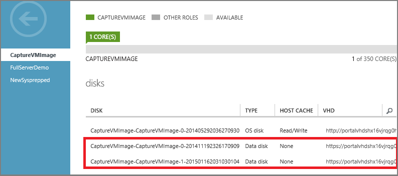
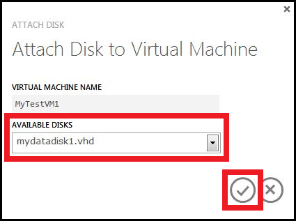

For more information about disks, see [About Virtual Machine Disks in Azure](../articles/virtual-machines-disks-vhds.md).

##How to: Attach an empty disk
Attaching an empty disk is the simpler way to add a data disk, because Azure creates the .vhd file for you and stores it in the storage account.

1. Click **Virtual Machines**, and then select the appropriate virtual machine.

2. On the command bar, click **Attach**, and then click **Attach Empty Disk**.

	

3.	The **Attach an Empty Disk** dialog box appears.

	

	Do the following:

	- In **File Name**, accept the default name or type another one for the .vhd file, which is used for the disk. The data disk uses an automatically generated name, even if you type another name for the .vhd file.

	- Type the **Size (GB)** of the data disk.

	- Click the check mark to finish.

4.	After the data disk is created and attached, it's listed in the dashboard of the virtual machine.

	

##How to: Attach an existing disk

Attaching an existing disk requires that you have a .vhd available in a storage account. Use the [Add-AzureVhd](http://go.microsoft.com/FWLink/p/?LinkID=391684) cmdlet to upload the .vhd file to the storage account. After you've created and uploaded the .vhd file, you can attach it to a virtual machine.

1. Click **Virtual Machines**, and then select the appropriate virtual machine.

2. On the command bar, click **Attach**, and then select **Attach Disk**.

	

	The **Attach Disk** dialog box appears.

	

3. Select the data disk that you want to attach to the virtual machine.

4. Click the check mark to attach the data disk to the virtual machine.

5.	After the data disk is attached, it's listed in the dashboard of the virtual machine.

	

> [AZURE.NOTE]
> After you add a data disk, you'll need to log on to the virtual machine and initialize the disk so the virtual machine can use the disk for storage.
