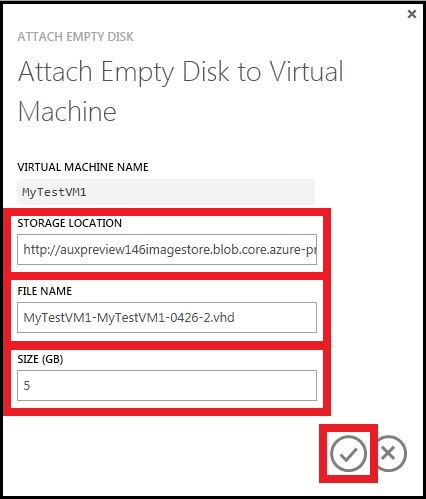

- [Concepts](#concepts)
- [How to: Attach an existing disk](#attachexisting)
- [How to: Attach an empty disk](#attachempty)

##Concepts

You can attach a data disk to a virtual machine to store application data. A data disk is a virtual hard disk (VHD) that you can create either locally with your own computer or in the cloud with Azure. You manage data disks in the virtual machine the same way you do on a server in your office.

You can use the Management Portal to upload and attach a data disk that contains data to the virtual machine, as well as add an empty disk from the same storage account used by the virtual machine. This article describes these processes. To attach an empty disk located in a different storage account, use the [Add-AzureDataDisk](http://go.microsoft.com/fwlink/p/?LinkId=391661) cmdlet, available in the Azure PowerShell module. To download the module, see the [Downloads](http://www.windowsazure.com/en-us/downloads/) page.

The virtual machine is not stopped to add the disk. The number of disks that you can attach to a virtual machine is based on the size of the virtual machine. For information about virtual machine and disk sizes, see [Virtual Machine Sizes for Azure](http://go.microsoft.com/FWLink/p/?LinkID=294683).

> [WACOM.NOTE] 
> Azure storage supports blobs up to 1 TB in size, which accommodates a VHD with a maximum virtual size of 999 GB. However, if you use Hyper-V to create a new VHD, the size you specify represents the virtual size. To use the VHD in Azure, specify a size no larger than 999 GB.

**Data Disk vs. Resource Disk**  
Data disks reside on Azure Storage and can be used for persistent storage of files and application data.

Each virtual machine also has a temporary, local *resource disk* attached. Because data on a resource disk may not be durable across reboots, it is often used by applications and processes running in the virtual machine for transient and temporary storage of data. It is also used to store page or swap files for the operating system.

On Windows, the resource disk is labeled as the **D:** drive.  On Linux, the resource disk is typically managed by the Azure Linux Agent and automatically mounted to **/mnt/resource** (or **/mnt** on Ubuntu images). Note that the resource disk is a *temporary* disk, and might be emptied when the VM is deprovisioned. On the other hand, on Linux the data disk might be named by the kernel as `/dev/sdc`, and users will need to partition, format and mount that resource. Please see the [Azure Linux Agent User Guide](http://www.windowsazure.com/en-us/manage/linux/how-to-guides/linux-agent-guide/) for more information.

For more information about using data disks, see [Manage disks and images](http://msdn.microsoft.com/en-us/library/windowsazure/jj672979.aspx).

##How to: Attach an existing disk

1. If you have not already done so, sign in to the [Azure Management Portal](http://manage.windowsazure.com).

2. Click **Virtual Machines**, and then select the virtual machine to which you want to attach the disk.

3. On the command bar, click **Attach**, and then select **Attach Disk**.

	

	The **Attach Disk** dialog box appears.

	

3. Select the data disk that you want to attach to the virtual machine.
4. Click the check mark to attach the data disk to the virtual machine.
  
 
	You will now see the data disk listed on the dashboard of the virtual machine.

	

##How to: Attach an empty disk

After you have created and uploaded a .vhd file to use as an empty disk, you can attach it to a virtual machine. Use the [Add-AzureVhd](http://go.microsoft.com/FWLink/p/?LinkID=391684) cmdlet to upload the .vhd file to the storage account.  

1. Click **Virtual Machines**, and then select the virtual machine to which you want to attach the data disk.

2. On the command bar, click **Attach**, and then select **Attach Empty Disk**.

	

	The **Attach Empty Disk** dialog box appears.

	

 
3. In **File Name**, either accept the automatically generated name or enter a name that you want to use for the VHD file that is stored. The data disk that is created from the VHD file will always use the automatically generated name.

4. In **Size**, enter the size of the data disk. 

5. Click the check mark to attach the empty data disk.

	You will now see the data disk listed on the dashboard of the virtual machine.

	

> [WACOM.NOTE] 
> After you add a data disk, you'll need to log on to the virtual machine and initialize the disk so the virtual machine can use the disk for storage.

