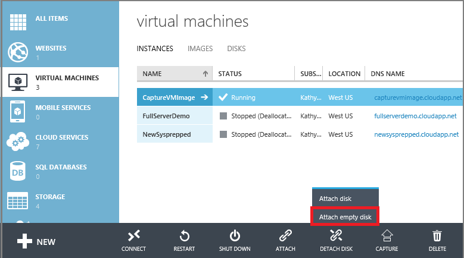
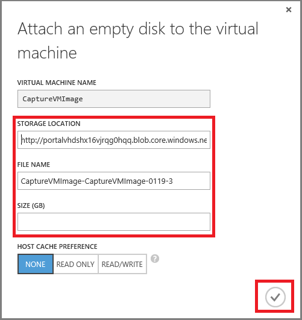
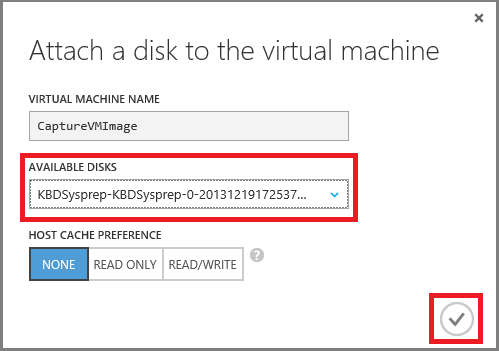
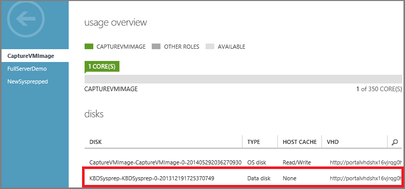

## Attach an empty disk

Attaching an empty disk is a simple way to add a data disk, because Azure creates the .vhd file for you and stores it in the storage account.

1. Click **Virtual Machines**, and then select the appropriate VM.

2. On the command bar, click **Attach**, and then click **Attach Empty Disk**.

	

3.	The **Attach an Empty Disk** dialog box appears.

	

	Do the following:

	- In **File Name**, accept the default name or type another one for the .vhd file. The data disk uses an automatically generated name, even if you type another name for the .vhd file.

	- Type the **Size (GB)** of the data disk.

	- Click the check mark to finish.

4.	After the data disk is created and attached, it's listed in the dashboard of the VM.

	

> [AZURE.NOTE] After you add a new data disk, you'll need to log on to the VM and initialize the disk so that it can be used. 

## How to: Attach an existing disk

Attaching an existing disk requires that you have a .vhd available in a storage account. Use the [Add-AzureVhd](https://msdn.microsoft.com/library/azure/dn495173.aspx) cmdlet to upload the .vhd file to the storage account. After you've created and uploaded the .vhd file, you can attach it to a VM.

1. Click **Virtual Machines**, and then select the appropriate virtual machine.

2. On the command bar, click **Attach**, and then select **Attach Disk**.

	

3. Select the data disk and then click the check mark to attach the data disk.

	

4.	After the data disk is attached, it's listed in the dashboard of the VM.

	
