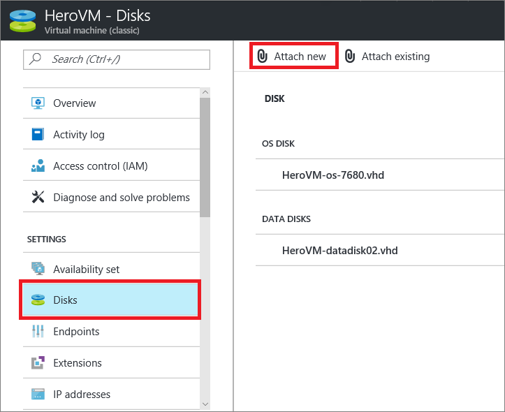
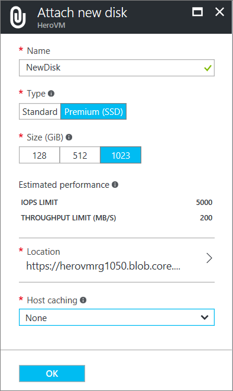
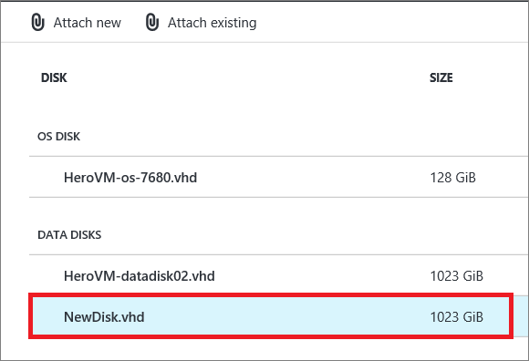
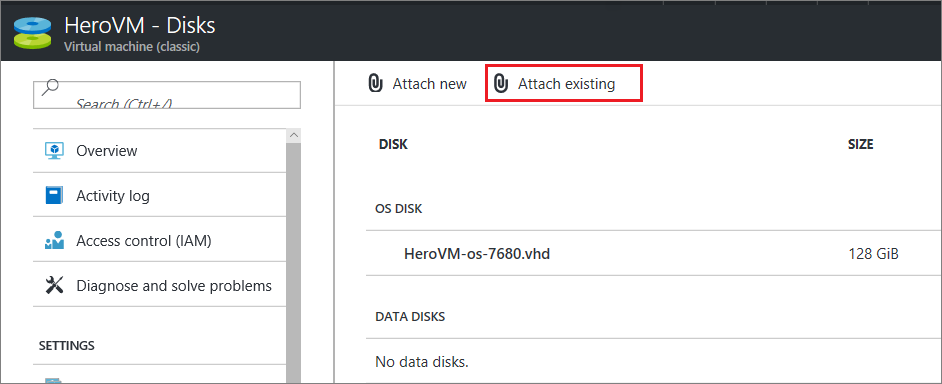
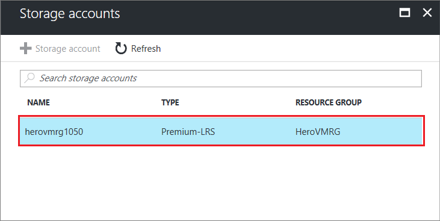
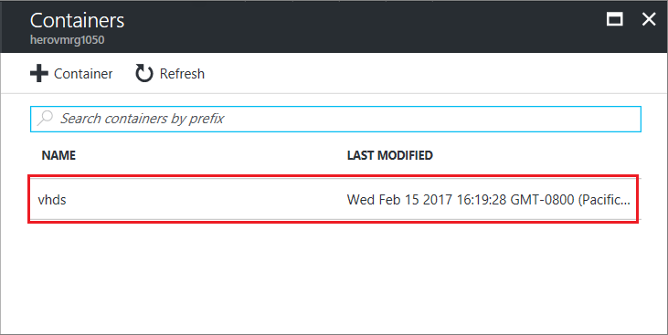
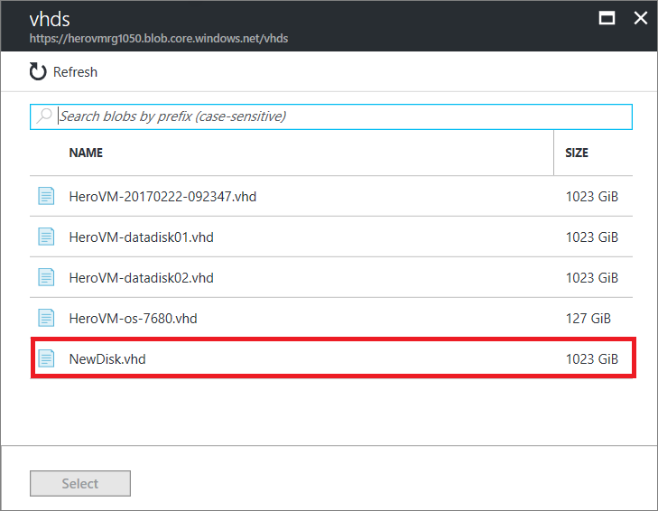
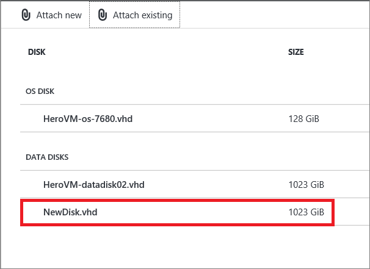

## Attach an empty disk
Attaching an empty disk is a simple way to add a data disk, because Azure creates the .vhd file for you and stores it in the storage account.

1. Click **Virtual Machines (classic)**, and then select the appropriate VM.

2. In the Settings menu, click **Disks**.

   

3. On the command bar, click **Attach new**.  
    The **Attach new disk** dialog box appears.

    

    Fill in the following information:
    - In **File Name**, accept the default name or type another one for the .vhd file. The data disk uses an automatically generated name, even if you type another name for the .vhd file.
    - Select the **Type** of the data disk. All virtual machines support standard disks. Many virtual machines also support premium disks.
    - Select the **Size (GB)** of the data disk.
    - For **Host caching**, choose none or Read Only.
    - Click OK to finish.

4. After the data disk is created and attached, it's listed in the disks section of the VM.

   

> [!NOTE]
> After you add a data disk, you need to log on to the VM and initialize the disk so that it can be used.

## How to: Attach an existing disk
Attaching an existing disk requires that you have a .vhd available in a storage account. Use the [Add-AzureVhd](https://msdn.microsoft.com/library/azure/dn495173.aspx) cmdlet to upload the .vhd file to the storage account. After you've created and uploaded the .vhd file, you can attach it to a VM.

1. Click **Virtual Machines (classic)**, and then select the appropriate virtual machine.

2. In the Settings menu, click **Disks**.

3. On the command bar, click **Attach existing**.

    

4. Click **Location**. The available storage accounts display. Next, select an appropriate storage account from those listed.

    

5. A **Storage account** holds one or more containers that contain disk drives (vhds). Select the appropriate container from those listed.

    

6. The **vhds** panel lists the disk drives held in the container. Click one of the disks, and then click Select.

    

7. The **Attach existing disk** panel displays again, with the location containing the storage account, container, and selected hard disk (vhd) to add to the virtual machine.

  Set **Host caching** to none or Read only, then click OK.

    
