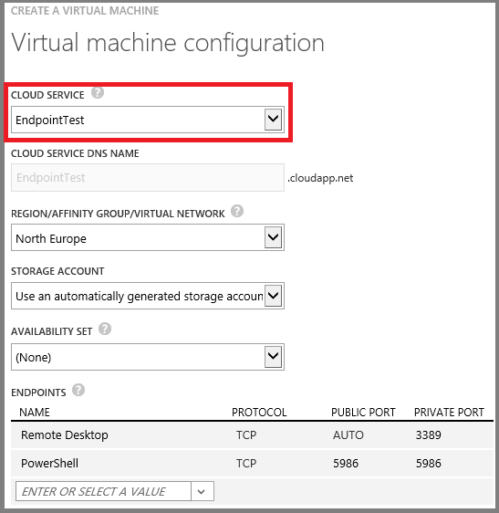

<properties authors="kathydav" editor="tysonn" manager="timlt" /> 

#How to Connect Virtual Machines with a Virtual Network or Cloud Service

Virtual machines must be in a cloud service, which acts as a container and provides a unique public DNS name, a public IP address, and a set of endpoints to access the virtual machine over the Internet. The cloud service can optionally be in a virtual network. 

If a cloud service is not in a virtual network, the virtual machines in that cloud service can only communicate with other virtual machines through the use of the other virtual machines’ public DNS names, and that traffic would travel over the Internet. If a cloud service is in a virtual network,  the virtual machines in that cloud service can communicate with all other virtual machines in the virtual network without sending any traffic over the Internet.

If you place your virtual machines in the same standalone cloud service, you can take advantage of load balancing and availability sets. For details, see [Load balancing virtual machines](../articles/load-balance-virtual-machines.md) and [Manage the availability of virtual machines](../articles/manage-availability-virtual-machines.md). However, you cannot organize the virtual machines on subnets or connect a standalone cloud service to your on-premises network. Here is an example.

 
If you place your virtual machines in a virtual network, you can decide how many cloud services you want to use to take advantage of load balancing and availability sets. Additionally, you can organize the virtual machines on subnets in the same way as your on-premises network and connect the virtual network to your on-premises network. Here is an example.

Virtual networks are the recommended way to connect virtual machines in Azure. The best practice is to configure each tier of your application in a separate cloud service. This enables advanced user rights delegation through Role Based Access Control (RBAC). For more information, see [Role Based Access Control in Azure Preview Portal](../articles/role-based-access-control-configure.md). However, you may need to combine some virtual machines from different application tiers into the same cloud service to remain within the maximum of 200 cloud services per subscription.

To connect virtual machines in a virtual network:

1.	Create the virtual network in the Azure Management Portal. For more information, see [Virtual Network Configuration Tasks](https://msdn.microsoft.com/library/azure/jj156206.aspx).
2.	Create the set of cloud services for your deployment in the Azure Management Portal to reflect your design for availability sets and load balancing with **New > Compute > Cloud Service > Custom Create**.
3.	When you create each new virtual machine, specify the correct cloud service and your virtual network. If the cloud service has been previously associated with your virtual network, its name will already be selected for you.

Here is an example using the Azure Management Portal.

 
To connect virtual machines in a standalone cloud service:

1.	Create the cloud service for your deployment in the Azure Management Portal with **New > Compute > Cloud Service > Custom Create**.
2.	When you create the virtual machine, specify the name of cloud service created in step 1. 
Alternately, you can create the cloud service for your deployment when you create your first virtual machine.

Here is an example using the Azure Management Portal for the existing cloud service named EndpointTest.
 

##Resources
[Load balancing virtual machines](../articles/load-balance-virtual-machines.md)

[Manage the availability of virtual machines](../articles/manage-availability-virtual-machines.md)

[Virtual Network Configuration Tasks](https://msdn.microsoft.com/library/azure/jj156206.aspx)

After you create a virtual machine, it's a good idea to add a data disk so your services and workloads have a location to store data. See one of the following:

[How to Attach a Data Disk to a Linux Virtual Machine](../articles/virtual-machines-linux-how-to-attach-disk.md)

[How to Attach a Data Disk to a Windows Virtual Machine](../articles/storage-windows-attach-disk.md)

