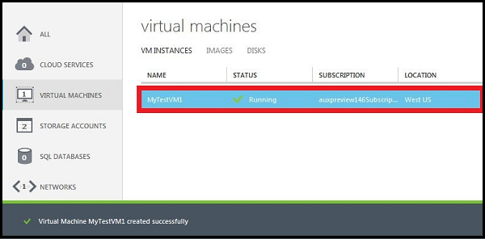

<properties authors="kathydav" editor="tysonn" manager="jeffreyg" />

#How to Create a Custom Virtual Machine

A *custom* virtual machine refers to a virtual machine you create using the **From Gallery** method because it lets you configure more options than the **Quick Create** method. These options include:

- More choices for the image to use to create the virtual machine (VM)
- Connecting the VM to a virtual network 
- Adding the VM to an existing cloud service 
- Adding the VM to an availability set

**Important**: If you want your virtual machine to use a virtual network so you can connect to it directly by hostname or set up cross-premises connections, make sure you specify the virtual network when you create the virtual machine. A virtual machine can be configured to join a virtual network only when you create the virtual machine. For more information about virtual networks, see [Azure Virtual Network Overview](http://go.microsoft.com/fwlink/p/?LinkID=294063).

1. Sign in to the [Azure Management Portal](http://manage.windowsazure.com).

2. On the command bar, click **New**.

3. Click **Compute**, click **Virtual Machine**, and then click **From Gallery**.

4. Choose the image you want to use, and then click the arrow to continue.

5. If multiple versions of the image are available, in **Version Release Date**, pick the version you want to use. 

6. In **Virtual Machine Name**, type the name that you want to use for the virtual machine.

7. Use **Tier** and **Size** to select the appropriate size for the virtual machine. The size you select affects the maximum configuration of the virtual machine, as well as the pricing. For configuration details, see [Virtual Machine and Cloud Service Sizes for Azure](http://go.microsoft.com/fwlink/p/?LinkID=389844).

8. In **New User Name**, type a name for the administrative account that you want to use to manage the server. 

9. In **New Password**, type a strong password for the administrative account. In **Confirm Password**, retype the same password.

10. Click the arrow to continue.

11. In **Cloud Service**, do one of the following:
	
	- If this is the first or only virtual machine in the cloud service, select **Create a New Cloud Service**. Then, in **Cloud Service DNS Name**, type a name that uses between 3 and 24 lowercase letters and numbers. This name becomes part of the URI that is used to contact the virtual machine through the cloud service.
	- If this virtual machine is being added to a cloud service, select it in the list.

	**Note**: For more information about placing virtual machines in the same cloud service, see [How to connect virtual machines in a cloud service](http://www.windowsazure.com/manage/windows/how-to-guides/connect-to-a-cloud-service/).

12. In **Region/Affinity Group/Virtual Network**, select region, affinity group, or virtual network that you want to use for the virtual machine. For more information about affinity groups, see [About Affinity Groups for Virtual Network](http://msdn.microsoft.com/library/azure/jj156085.aspx).

13. In **Storage Account**, select an existing storage account for the VHD file, or use an automatically generated storage account. Only one storage account per region is automatically created. All other virtual machines that you create with this setting are located in this storage account. You are limited to 20 storage accounts.

14. If you want the virtual machine to belong to an availability set, in **Availability Set**, select **Create availability set** or add it to an existing availability set. 

	**Note**: Virtual machine that are members of an availability set are deployed to different fault domains. Placing multiple virtual machines in an availability set helps ensure that your application is available during network failures, local disk hardware failures, and any planned downtime.

15.  Under **Endpoints**, review the new endpoints that will be created to allow connections to the virtual machine, such through Remote Desktop or a Secure Shell (SSH) client. You also can add endpoints now, or create them later. For instructions on creating them later, see [How to Set Up Endpoints to a Virtual Machine](../articles/virtual-machines-set-up-endpoints.md). 

16.  Under **VM Agent**, decide whether to install the VM Agent. This agent provides the environment for you to install extensions that can help you interact with the virtual machine. For details, see [Manage Extensions](http://go.microsoft.com/FWLink/p/?LinkID=390493).

17. Click the arrow to create the virtual machine.

	

##Next Steps##
After the virtual machine is created, it's started automatically. When the portal shows the status as running, you can log in to the virtual machine. For instructions, see one of the following articles:

- [How to Log on to a Virtual Machine Running Linux](../articles/virtual-machines-linux-how-to-log-on.md)
- [How to Log on to a Virtual Machine Running Windows Server](../articles/virtual-machines-log-on-windows-server.md)

