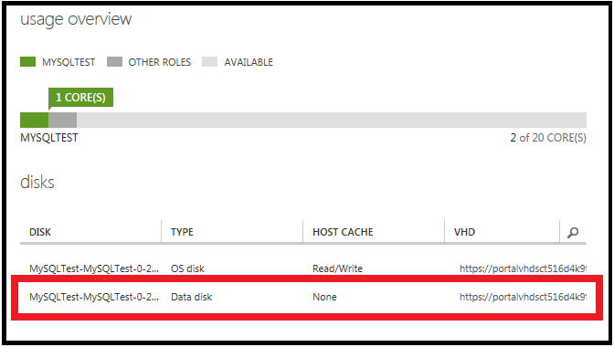
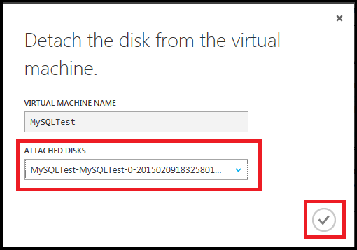

<properties writer="kathydav" editor="tysonn" manager="timlt" />

When you no longer need a data disk that's attached to a virtual machine, you can easily detach it. This removes the disk from the virtual machine, but doesn't remove it from storage. 

If you want to use the existing data on the disk again, you can reattach it to the same virtual machine, or another one.  

> [AZURE.NOTE] To detach an operating system disk you first need to delete the virtual machine.

## Find the disk

If you don't know the name of the disk or want to verify it before you detach it, follow these steps.

1. Sign in to the [Azure classic portal](http://manage.windowsazure.com).

2. Click **Virtual Machines**, click the name of virtual machine, and then click **Dashboard**.

3. Under **Disks**, the table lists the name and type of all attached disks. For example, this screen shows a virtual machine with one operating system (OS) disk and one data disk:

	

## Detach the disk

1. Click **Virtual Machines**, click the name of the virtual machine that has the data disk you want to detach, and then click **Dashboard**.

2. From the command bar, click **Detach Disk**.

3. Select the data disk, and then click the check mark to detach it.

	

The disk remains in storage but is no longer attached to a virtual machine.
