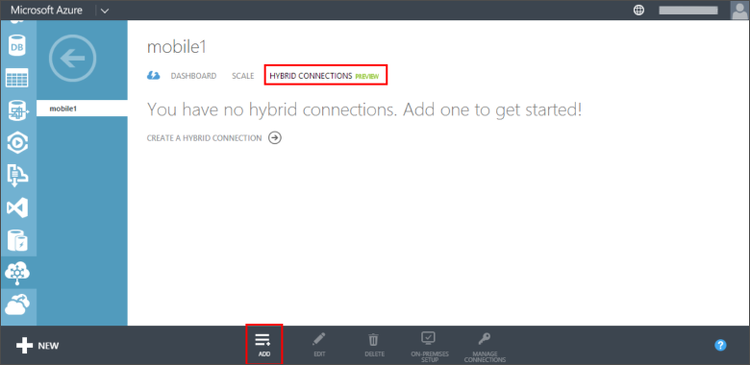
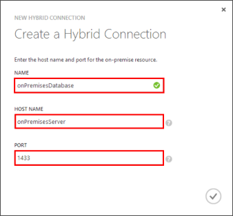

1. On the on-premises machine, log on to the [Azure Management Portal](http://manager.windowsazure.com) (this is the old portal).

2. At the bottom of the navigation pane, select **+NEW** > **App Services** > **BizTalk Service** > **Custom Create**.

3. Provide a **BizTalk Service Name** and select an **Edition**. 

	This tutorial uses **mobile1**. You will need to supply a unique name for your new BizTalk Service.

4. Once the BizTalk Service has been created, select the **Hybrid Connections** tab, then click **Add**.

	

	This creates a new hybrid connection.

5. Provide a **Name** and **Host Name** for your hybrid connection and set **Port** to `1433`. 
  
	

	The host name is the name of the on-premises server. This configures the hybrid connection to access SQL Server running on port 1433. If you are using a named SQL Server instance, instead use the static port you defined earlier.

6. After the new connection is created, the status of the of the new connection shows **On-premises setup incomplete**.

7. Navigate back to your mobile service, click **Configure**, scroll down to **Hybrid connections** and click **Add hybrid connection**, then select the hybrid connection that you just created and click **OK**.

    This enables your mobile service to use your new hybrid connection.

Next, you'll need to install the Hybrid Connection Manager on the on-premises computer.