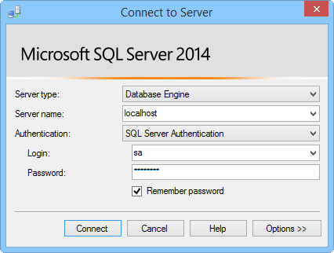

This section shows you how to install a SQL Server Express, enable TCP/IP, set a static port, and create a database that can be used with Hybrid Connections.  

###Install SQL Server Express

To use an on-premises SQL Server or SQL Server Express database with a hybrid connection, TCP/IP needs to be enabled on a static port. Default instances on SQL Server use static port 1433, whereas named instances do not. Because of this, we will install the default instance. If you already have the default instance of SQL Server Express installed, you can skip this section.

1. To install SQL Server Express, run the **SQLEXPRWT_x64_ENU.exe** or **SQLEXPR_x86_ENU.exe** file that you downloaded. The SQL Server Installation Center wizard appears.
	
2. Choose **New SQL Server stand-alone installation or add features to an existing installation**, follow the instructions, accepting the default choices and settings, until you get to the **Instance Configuration** page.
	
3. On the **Instance Configuration** page, choose **Default instance**, then accept the default settings on the **Server Configuration** page.

	>[AZURE.NOTE]If you already have a default instance of SQL Server installed, you can skip to the next section and use this instance with Hybrid Connections. 
	
5. On the **Database Engine Configuration** page, under **Authentication Mode**, choose **Mixed Mode (SQL Server authentication and Windows authentication)**, and provide a secure password for the built-in **sa** administrator account.
	
	In this tutorial, you will be using SQL Server authentication. Be sure to remember the password that you provide, because you will need it later.
	
6. Finish the wizard to complete the installation.

###Enable TCP/IP and setting a static port

This section uses SQL Server Configuration Manager, which was installed when you installed SQL Server Express, to enable TCP/IP and set a static IP address. 

1. Follow the steps in [Enable TCP/IP Network Protocol for SQL Server](http://technet.microsoft.com/library/hh231672%28v=sql.110%29.aspx) to enable TCP/IP access to the instance.

2. (Optional) If you are not able to use the default instance, you must follow the steps in [Configure a Server to Listen on a Specific TCP Port ](https://msdn.microsoft.com/library/ms177440.aspx) to set a static port for the instance. If you complete this step, you will connect using the new port that you define, instead of port 1433.

3. (Optional) If needed, add exceptions in the firewall to allow remote access to the SQL Server process (sqlservr.exe).

###Create a new database in the on-premises SQL Server instance

1. In SQL Server Management Studio, connect to the SQL Server you just installed. (If the **Connect to Server** dialog does not appear automatically, navigate to **Object Explorer** in the left pane, click **Connect**, and then click **Database Engine**.) 	

	
	
	For **Server type**, choose **Database Engine**. For **Server name**, you can use **localhost** or the name of the computer where you installed SQL Server. Choose **SQL Server authentication**, and supply the password for the sa login that you created earlier. 
	
2. To create a new database by using SQL Server Management Studio, right-click **Databases** in Object Explorer, and then click **New Database**.
	
3. In the **New Database** dialog, type `OnPremisesDB`, and then click **OK**. 
	
4. In Object Explorer, if you expand **Databases**, you will see that the new database is created.

###Create a new SQL Server login and set permissions

Finally, you will create a new SQL Server login with restricted permissions. Your Azure service will connect to the on-premise SQL Server using this login instead of the built-in sa login, which has full permissions on the server.

1. In SQL Server Management Studio Object Explorer, right-click the **OnPremisesDB** database and click **New Query**.

2.  Paste the following TSQL query into the query window.

		USE [master]
		GO
		
		/* Replace the PASSWORD in the following statement with a secure password. 
		   If you save this script, make sure that you secure the file to 
		   securely maintain the password. */ 
		CREATE LOGIN [HybridConnectionLogin] WITH PASSWORD=N'<**secure_password**>', 
			DEFAULT_DATABASE=[OnPremisesDB], DEFAULT_LANGUAGE=[us_english], 
			CHECK_EXPIRATION=OFF, CHECK_POLICY=ON
		GO
	
		USE [OnPremisesDB]
		GO
	
		CREATE USER [HybridConnectionLogin] FOR LOGIN [HybridConnectionLogin] 
		WITH DEFAULT_SCHEMA=[dbo]
		GO

		GRANT CONNECT TO [HybridConnectionLogin]
		GRANT CREATE TABLE TO [HybridConnectionLogin]
		GRANT CREATE SCHEMA TO [HybridConnectionLogin]
		GO  
   
3. In the above script, replace the string `<**secure_password**>` with a secure password for the new *HybridConnectionsLogin*.

4. **Execute** the query to create the new login and grant the required permissions in the on-premises database.

