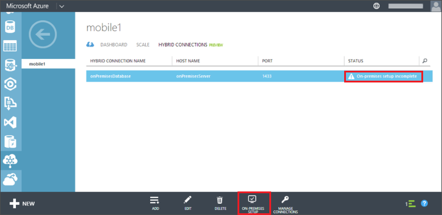

The Hybrid Connection Manager enables your on-premises machine to connect to Azure and relay TCP traffic. You must  install the manager to an on-premises computer that can connect to the your SQL Server instance.

1. The connection you just created should have a **Status** of **On-premesis setup incomplete**. Click this connection and click **On-premises Setup**.

	

2. Click **Install and Configure**.

	This installs a customized instance of the Connection Manager, which is already pre-configured to work with the hybrid connection you just created.

3. Complete the rest of the setup steps for the Connection Manager.

	After the installation is complete, the hybrid connection status will change to **1 Instance Connected**. You may need to refresh the browser and wait a few minutes. 

The hybrid connection setup is now complete.