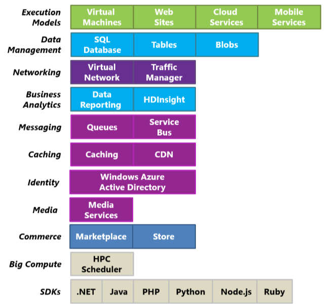
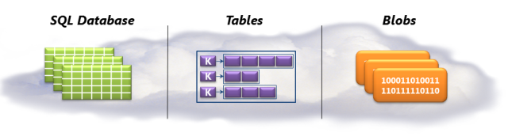
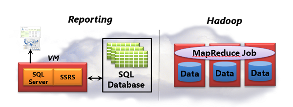
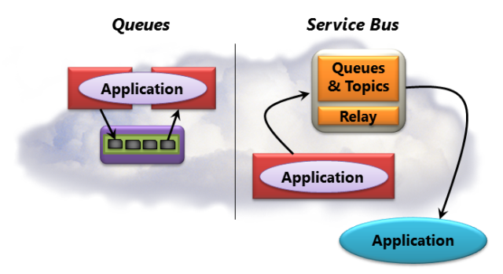

# Introducing Azure

Azure is Microsoft's application platform for the public cloud. You can use this platform in many different ways. For instance, you can use Azure to build a web application that runs and stores its data in Azure datacenters. You can use Azure just to store data, with the applications that use this data running on-premises (that is, outside the public cloud). You can use Azure to create virtual machines for development and test or to run SharePoint and other applications. You can use Azure to build massively scalable applications with lots and lots of users. Because the platform offers a wide range of services, all of these things-and more-are possible.

To do any of them, though, you need to understand the basics. Even if you don't know anything about cloud computing, this article will walk you through the fundamentals of Azure. The goal is to give you a foundation for understanding and using this cloud platform.

## Table of Contents

-   [The Components of Azure](#components)
-   [Execution Models/Compute](#models)
-   [Data Management](#data)
-   [Networking](#networking)
-   [Business Analytics](#analytics)
-   [Messaging](#messaging)
-   [Caching](#caching)
-   [Identity](#identity)
-   [High-Performance Computing (HPC)](#HPC)
-   [Media](#media)
-   [Commerce](#commerce)
-   [SDKs](#sdk)
-   [Getting Started](#start)

<h2>The Components of Azure</h2>

To understand what Azure offers, it's useful to group its
services into distinct categories. Figure 1 shows one way to do this.

   
 **Figure 1: Azure provides Internet-accessible application services running in Azure datacenters.**

To get started with Azure, you need to know at least the basics about each of its components.You can also use the [What Is Azure Poster](http://www.microsoft.com/en-us/download/details.aspx?id=35473) for a quick, visual way to get an overview. The colors of the boxes in Figure 1 correspond to their grouping on the poster. 

The rest of this article walks through the technologies shown in the figure, describing what each one offers and when you might use it.

<h2>Execution Models / Compute</h2>

One of the most basic things a cloud platform does is execute applications. Azure provides four options for doing this: Virtual Machines, Cloud Services, Websites, and Mobile Services.  Each of the Azure execution models has its own role to play. 

Azure Virtual Machines provides a general-purpose on-demand computing environment. Cloud Services is a great choice for creating scalable, reliable applications with low administration costs. Azure Websites offers a range of applications, frameworks, and templates for you to build large, scalable web applications and presence websites quickly, and then efficiently manage development, test, and operations. Similarly, Azure Mobile Services accelerates the development of apps for mobile devices, providing turnkey ways to store data in the cloud, authenticate users, and send push notifications.

You can use these technologies separately or combine them as needed to create the right foundation for your application. The approach you choose depends on what problems you're trying to solve.

###Virtual Machines###

The ability to create a virtual machine on demand, whether from a standard image or from one you supply, can be very useful. Add the ability to pay for this VM by the minute and only while it's running, and it's even more useful. This approach, commonly known as Infrastructure as a Service (IaaS), is what Azure Virtual Machines provides. 

To create a VM, you specify which VHD to use and the VM's size. You then pay for the time that the VM is running. Azure Virtual Machines offers a gallery of stock VHDs. These include Microsoft-provided options, such as Windows Server 2008 R2, Windows Server 2012, and Windows Server 2008 R2 with SQL Server, along with Linux images provided by Microsoft partners. You're free to create VMs from your own VHDs and add them to the gallery as well.
 
Wherever the image comes from, you can persistently store any changes made while a VM is running. The next time you create a VM from that VHD, things pick up where you left off. It's also possible to copy the changed VHD out of Azure, then run it locally.

Azure VMs can be used in many different ways. You might use them to create an inexpensive development and test platform that you can shut down when you've finished using it. You might also create and run applications that use whatever languages and libraries you like. Those applications can use any of the data management options that Azure provides, and you can also choose to use SQL Server or another DBMS running in one or more virtual machines. Another option is to use Azure VMs as an extension of your on-premises datacenter, running SharePoint or other applications. To support this, it's possible to create Windows domains in the cloud by running Active Directory in Azure VMs. This quite general approach to cloud computing can be used to address many different problems. What you do is up to you.

###Websites###

One of the most common things that people do in the cloud is run websites and web applications. Azure Virtual Machines allows this, but it still leaves you with the responsibility of administering one or more VMs. What if you just want a website where somebody else takes care of the administrative work for you?

This is exactly what Azure Websites provides. This execution model offers a managed web environment using the Azure Management portal as well as APIs. You can move an existing website into Azure Websites unchanged, or you can create a new one directly in the cloud. Once a website is running, you can add or remove instances dynamically, relying on Azure Websites to load balance requests across them. Azure Websites offers both a shared option, where your website runs in a virtual machine with other sites, and a standard option that allows a site to run in its own VM. The standard option also lets you increase the size (computing power) of your instances if needed.

Azure Websites is intended to be useful for corporations, developers, and web design agencies. For corporations, it's an easy-to-manage, scalable, highly secure, and highly available solution for running presence websites. For development, it supports .NET, PHP, Node.js, and Python along with SQL Database and MySQL (from ClearDB, a Microsoft partner) for relational storage. It also provides built-in support for several popular applications, including WordPress, Joomla, and Drupal. The goal is to provide a low-cost, scalable, and broadly useful platform for creating websites and web applications in the public cloud.

###Cloud Services###

Suppose you want to build a cloud application that can support lots of simultaneous users, doesn't require much administration, and never goes down. You might be an established software vendor, for example, that's decided to embrace Software as a Service (SaaS) by building a version of one of your applications in the cloud. Or you might be a start-up creating a consumer application that you expect will grow fast. If you're building on Azure, which execution model should you use?

Azure Websites allows creating this kind of web application, but there are some constraints. You don't have administrative access, for example, which means that you can't install arbitrary software.  Azure Virtual Machines gives you lots of flexibility, including administrative access, and you certainly can use it to build a very scalable application, but you'll have to handle many aspects of reliability and administration yourself. What you'd like is an option that gives you the control you need but also handles most of the work required for reliability and administration.

This is exactly what's provided by Azure Cloud Services. This technology is designed expressly to support scalable, reliable, and low-admin applications, and it's an example of what's commonly called Platform as a Service (PaaS). To use it, you create an application using the technology you choose, such as C#, Java, PHP, Python, Node.js, or something else. Your code then executes in virtual machines (referred to as instances) running a version of Windows Server. 

But these VMs are distinct from the ones you create with Azure Virtual Machines. For one thing, Azure itself manages them, doing things like installing operating system patches and automatically rolling out new patched images. (This implies that your application shouldn't maintain state in web or worker role instances; it should instead be kept in one of the Azure data management options described in the next section.) Azure also monitors the VMs, restarting any that fail. 

You have two roles to choose from when you create an instance, both based on Windows Server. The main difference between the two is that an instance of a web role runs IIS, while an instance of a worker role does not. Both are managed in the same way, however, and it's common for an application to use both. For example, a web role instance might accept requests from users, then pass them to a worker role instance for processing. To scale your application up or down, you can request that Azure create more instances of either role or shut down existing instances. And similar to Azure Virtual Machines, you're charged only for the time that each web or worker role instance is running. 

###Mobile Services###

If you are creating an app for a mobile device, Azure Mobile Services accelerates development by providing turnkey way to store data in the cloud, authenticate users, and send push notifications.  
Native client libraries for Android, iOS, HTML/JavaScript, Windows Phone, and Windows Store make it easy to power apps available on all major mobile platforms.  An open and flexible REST API also enables you to use Mobile Services data and authentication functionality with apps on almost any platform.  A single Mobile Service can back multiple client apps so you can provide a consistent user experience across devices. 

Mobile Services allows you to do simple provisioning and management of data stored in a SQL Database, authenticate users through well-known identity providers like Facebook, Twitter, Microsoft or Google account, and use notification services to deliver push notifications to your app. With server-side code you can easily use additional data storage options like blob storage or MongoDB, consume Add-Ons from the Azure Store like SendGrid or Pusher, use other Azure Services like Service Bus and worker roles, or even connect to on-premises systems.  A service can be scaled as an app becomes more popular, and monitoring and logging are supported.

While you can certainly build the backend for a mobile app using Virtual Machines, Cloud Services or Websites, by opting for Mobile Services you can spend much less time writing the underlying service components.

<h2>Data Management</h2>

Applications need data, and different kinds of applications need different kinds of data. Because of this, Azure provides several different ways to store and manage data. 

One of these has already been mentioned: the ability to run SQL Server or another DBMS in a VM created with Azure Virtual Machines. (It's important to realize that this option isn't limited to relational systems; you're also free to run NoSQL technologies such as MongoDB and Cassandra.) Running your own database system is straightforward-it replicates what we're used to in our own datacenters-but it also requires handling the administration of that DBMS. To make life easier, Azure provides three data management options that are largely managed for you. Figure 2 shows the choices.

   
 **Figure 2: For data management, Azure provides relational storage, scalable NoSQL tables, and unstructured binary storage.**

Each of the three options addresses a different need: relational storage, fast access to potentially large amounts of simple typed data, and unstructured binary storage. In all three cases, data is automatically replicated across three different computers in an Azure datacenter to provide high availability. It's also worth pointing out that all three options can be accessed either by Azure applications or by applications running elsewhere, such as your on-premises datacenter, your laptop, or your phone. And however you apply them, you pay for all Azure data management services based on usage, including a gigabyte-per-month charge for stored data. 

###SQL Database###

For relational storage, Azure provides SQL Database. Formerly called SQL Azure, SQL Database provides all of the key features of a relational database management system, including atomic transactions, concurrent data access by multiple users with data integrity, ANSI SQL queries, and a familiar programming model. Like SQL Server, SQL Database can be accessed using Entity Framework, ADO.NET, JDBC, and other familiar data access technologies. It also supports most of the T-SQL language, along with SQL Server tools such as SQL Server Management Studio. For anybody familiar with SQL Server (or another relational database), using SQL Database is straightforward.

But SQL Database isn't just a DBMS in the cloud-it's a PaaS service. You still control your data and who can access it, but SQL Database takes care of the administrative grunt work, such as managing the hardware infrastructure and automatically keeping the database and operating system software up to date. SQL Database also provides a federation option that distributes data across multiple servers. This is useful for applications that work with large amounts of data or need to spread data access requests across multiple servers for better performance.

If you're creating an Azure application (using any of the three execution models) that needs relational storage, SQL Database can be a good option. Applications running outside the cloud can also use this service, though, so there are plenty of other scenarios. For instance, data stored in SQL Database can be accessed from different client systems, including desktops, laptops, tablets, and phones. And because it provides built-in high availability through replication, using SQL Database can help minimize downtime.

###Tables###

Suppose you want to create an Azure application that needs fast access to typed data, maybe lots of it, but doesn't need to perform complex SQL queries on this data. For example, imagine you're creating a consumer application that needs to store customer profile information for each user. Your app is going to be very popular, so you need to allow for lots of data, but you won't do much with this data beyond storing it, then retrieving it in simple ways. This is exactly the kind of scenario where Azure Tables makes sense.

Don't be confused by the name: this technology doesn't provide relational storage. (In fact, it's an example of a NoSQL approach called a key/value store.) Instead, Azure Tables let an application store properties of various types, such as strings, integers, and dates. An application can then retrieve a group of properties by providing a unique key for that group. While complex operations like joins aren't supported, tables offer fast access to typed data. They're also very scalable, with a single table able to hold as much as a terabyte of data. And matching their simplicity, tables are usually less expensive to use than SQL Database's relational storage. 

###Blobs###

The third option for data management, Azure Blobs, is designed to store unstructured binary data. Like Tables, Blobs provides inexpensive storage, and a single blob can be as large as one terabyte. An application that stores video, for example, or backup data or other binary information can use blobs for simple, cheap storage. Azure applications can also use Azure drives, which let blobs provide persistent storage for a Windows file system mounted in an Azure instance. The application sees ordinary Windows files, but the contents are actually stored in a blob.

<h2>Networking</h2>

Azure runs today in several datacenters spread across the United States, Europe, and Asia. When you run an application or store data, you can select one or more of these datacenters to use. You can also connect to these datacenters in various ways:

- You can use Azure Virtual Network to connect your own on-premises local network to a defined set of Azure VMs.

- If your Azure application is running in multiple datacenters, you can use Azure Traffic Manager to route requests from users intelligently across instances of the application.

Figure 3 illustrates these options.

   
 **Figure 3: Azure allows creating a cloud VPN, and intelligently distributing user requests across different datacenters.**

###Virtual Network###

One useful way to use a public cloud is to treat it as an extension of your own datacenter. Because you can create VMs on demand, then remove them (and stop paying) when they're no longer needed, you can have computing power only when you want it. And since Azure Virtual Machines lets you can create VMs running SharePoint, Active Directory, and other familiar on-premises software, this approach can work with the applications you already have.

To make this really useful, though, your users ought to be able to treat these applications as if they were running in your own datacenter. This is exactly what Azure Virtual Network allows. Using a VPN gateway device, an administrator can set up a virtual private network (VPN) between your local network and a defined group of VMs running in Azure. Because you assign your own IP v4 addresses to the cloud VMs, they appear to be on your own network. Users in your organization can access the applications those VMs contain as if they were running locally.

###Traffic Manager###

an Azure application with users in just a single part of the world might run in only one Azure datacenter. An application with users scattered around the world, however, is more likely to run in multiple datacenters, maybe even all of them. In this second situation, you face a problem: How do you intelligently direct users to application instances? Most of the time, you probably want each user to access the datacenter closest to her, since it will likely give her the best response time. But what if that instance of the application is overloaded or unavailable? In this case, it would be nice to direct her request automatically to another datacenter. This is exactly what's done by Azure Traffic Manager. 

The owner of an application defines rules that specify how requests from users should be directed to datacenters, then relies on Traffic Manager to carry out these rules. For example, users might normally be directed to the closest Azure datacenter, but get sent to another one when the response time from their default datacenter exceeds the response time from other datacenters. For globally distributed applications with many users, having a built-in service to handle problems like these is useful.

<h2>Business Analytics</h2>

Analyzing data is a fundamental part of how businesses use information technology. A cloud platform provides a pool of on-demand, pay-per-use resources, which makes it a good foundation for this kind of computing. Accordingly, Azure provides two options for business analytics. Figure 4 illustrates the choices.

   
 **Figure 4: For business analytics, Azure provides reporting and support for big data.**

Analyzing data can take many forms, and so these two options are quite different. It's worth looking at each one separately.

###Reporting with SQL Database###
One of the most common ways to use stored data is to create reports based on that data.
 
Running SQL Server Reporting Services (SSRS) on Azure Virtual Machines allows you to build easily accessible reporting capabilities into your Azure application. You can create reports with tables, charts, maps, gauges, and more in various formats, including HTML, XML, PDF, and Excel. 

You can also perform analytics with SQL Database data using on-premises business intelligence tools, including SSRS. To a client, SQL Database looks like SQL Server, and so the same technologies can work with both.  
 

###HDInsight (Hadoop)###

For many years, the bulk of data analysis has been done on relational data stored in a data warehouse built with a relational DBMS. This kind of business analytics is still important, and it will be for a long time to come. But what if the data you want to analyze is so big that relational databases just can't handle it? And suppose the data isn't relational? It might be server logs in a datacenter, for example, or historical event data from sensors, or something else. In cases like this, you have what's known as a big data problem. You need another approach.

The dominant technology today for analyzing big data is Hadoop. An Apache open source project, this technology stores data using the Hadoop Distributed File System (HDFS), then lets developers create MapReduce jobs to analyze that data. HDFS spreads data across multiple servers, then runs chunks of the MapReduce job on each one, letting the big data be processed in parallel.

HDInsight is the name of the Azure's Apache Hadoop-based service. As Figure 4 suggests, HDInsight lets HDFS store data on the cluster and distribute it across multiple VMs. It also spreads the logic of a MapReduce job across those VMs. Just as with on-premises Hadoop, data is processed locally-the logic and the data it works on are in the same VM-and in parallel for better performance. HDInsight can also store data in Azure Storage Vault (ASV), which uses blobs.  Using ASV allows you to save money because you can delete your HDInsight cluster when not in use, but still keep your data in the cloud.
 
HDinsight supports other components of the Hadoop ecosystem as well, including Hive and Pig. Microsoft has also created components that make it easier to work with data produced by HDInsight using traditional BI tools, such as the HiveODBC adapter and Data Explorer that work with Excel.

<h2>Messaging</h2>

No matter what it's doing, code frequently needs to interact with other code.  In some situations, all that's needed is basic queued messaging. In other cases, more complex interactions are required. Azure provides a few different ways to solve these problems. Figure 5 illustrates the choices. 

   
 **Figure 5: For connecting applications, Azure provides queues, publish/subscribe, and synchronous connections via the cloud.**

###Queues###

Queuing is a simple idea: One application places a message in a queue, and that message is eventually read by another application. If your application needs just this straightforward service, Azure Queues might be the best choice. 

One common use of Queues today is to let a web role instance communicate with a worker role instance within the same Cloud Services application. For example, suppose you create an Azure application for video sharing. The application consists of PHP code running in a web role that lets users upload and watch videos, together with a worker role implemented in C# that translates uploaded video into various formats. When a web role instance gets a new video from a user, it can store the video in a blob, then send a message to a worker role via a queue telling it where to find this new video. A worker role instance-it doesn't matter which one-will then read the message from the queue and carry out the required video translations in the background. Structuring an application in this way allows asynchronous processing, and it also makes the application easier to scale, since the number of web role instances and worker role instances can be varied independently.

###Service Bus###

Whether they run in the cloud, in your data center, on a mobile device, or somewhere else, applications need to interact. The goal of Azure Service Bus is to let applications running pretty much anywhere exchange data.

As Figure 5 shows, Service Bus provides a queuing service. This service isn't identical to the Queues just described, however. Unlike Azure Queues, for example, Service Bus provides a both queues (one-to-one) and publish-and-subscribe mechanisms. With publish-subscribe, an application can send messages to a topic, while other applications can create subscriptions to this topic. This allows one-to-many communication among a set of applications, letting the same message be read by multiple recipients. And queuing isn't the only option: Service Bus also allows direct communication through its relay service, providing a secure way to interact through firewalls. Service Bus relays enable applications to communicate by exchanging messages through an endpoint hosted in the cloud, rather than locally.

Applications that communicate through Service Bus might be Azure applications or software running on some other cloud platform. They can also be applications running outside the cloud, however. For example, think of an airline that implements reservation services in computers inside its own datacenter. The airline needs to expose these services to many clients, including check-in kiosks in airports, reservation agent terminals, and maybe even customers' phones. It might use Service Bus to do this, creating loosely coupled interactions among the various applications.

<h2>Caching</h2>

Applications tend to access the same data over and over. One way to improve performance is to keep a copy of that data closer to the application, minimizing the time needed to retrieve it. Azure provides two different services for doing this: in-memory caching of data used by Azure applications and a content delivery network (CDN) that caches blob data on disk closer to its users. Figure 6 shows both.

   
 **Figure 6: an Azure application can cache data in memory, and copies of a blob can be cached at sites around the world.**

###Caching###

Accessing data stored in any of Azure's data management services-SQL Database, Tables, or Blobs-is quite fast. Yet accessing data stored in memory is even faster. Because of this, keeping an in-memory copy of frequently accessed data can improve application performance. You can use Azure's in-memory Caching to do this. 

A Cloud Services application can store data in this cache, then retrieve it directly without needing to access persistent storage. As Figure 6 shows, the cache can be maintained inside your application's VMs or be provided by VMs dedicated solely to caching. In either case, the cache can be distributed, with the data it contains spread across multiple VMs in an Azure datacenter. 

An application that repeatedly reads a product catalog might benefit from using this kind of caching, for example, since the data it needs will be available more quickly. The technology also supports locking, letting it be used with read/write as well as read-only data. And ASP.NET applications can use the service to store session data with just a configuration change. 

###CDN###

Suppose you need to store blob data that will be accessed by users around the world. Maybe it's a video of the latest World Cup match, for instance, or driver updates, or a popular e-book. Storing a copy of the data in multiple Azure datacenters will help, but if there are lots of users, it's probably not enough. For even better performance, you can use the Azure CDN.

The CDN has dozens of sites around the world, each capable of storing copies of Azure blobs. The first time a user in some part of the world accesses a particular blob, the information it contains is copied from an Azure datacenter into local CDN storage in that geography. After this, accesses from that part of the world will use the blob copy cached in the CDN-they won't need to go all the way to the nearest Azure datacenter. The result is faster access to frequently accessed data by users anywhere in the world.

<h2>Identity</h2>

Working with identity is part of most applications. For example, knowing who a user is lets an application decide how it should interact with that user. To help you do this, Microsoft provides Azure Active Directory.

Like most directory services, Azure Active Directory stores information about users and the organizations they belong to. It lets users log in, then supplies them with tokens they can present to applications to prove their identity. It also allows synchronizing user information with Windows Server Active Directory running on premises in your local network. While the mechanisms and data formats used by Azure Active Directory aren't identical with those used in Windows Server Active Directory, the functions it performs are quite similar. 

It's important to understand that Azure Active Directory is designed primarily for use by cloud applications. It can be used by applications running on Azure, for example, or on other cloud platforms. It's also used by Microsoft's own cloud applications, such as those in Office 365. If you want to extend your datacenter into the cloud using Azure Virtual Machines and Azure Virtual Network, however, Azure Active Directory isn't the right choice. Instead, you'll want to run Windows Server Active Directory in cloud VMs, as described earlier.

To let applications access the information it contains, Azure Active Directory provides a RESTful API called Azure Active Directory Graph. This API lets applications running on any platform access directory objects and the relationships among them.  For example, an authorized application might use this API to learn about a user, the groups he belongs to, and other information. Applications can also see relationships between users-their social graph-letting them work more intelligently with the connections among people.

Another capability of this service, Azure Active Directory Access Control, makes it easier for an application to accept identity information from Facebook, Google, Windows Live ID, and other popular identity providers. Rather than requiring the application to understand the diverse data formats and protocols used by each of these providers, Access Control translates all of them into a single common format. It also lets an application accept logins from one or more Active Directory domains. For example, a vendor providing a SaaS application might use Azure Active Directory Access Control to give users in each of its customers single sign-on to the application.

Directory services are a core underpinning of on-premises computing. It shouldn't be surprising that they're also important in the cloud.

<h2>Media</h2>

Video makes up a large part of Internet traffic today, and that percentage will be even larger tomorrow. Yet providing video on the web isn't simple. There are lots of variables, such as the encoding algorithm and the display resolution of the user's screen. Video also tends to have bursts in demand, like a Saturday night spike when lots of people decide they'd like to watch an online movie. 

Given its popularity, it's a safe bet that many new applications will be created that use video. Yet all of them will need to solve some of the same problems, and making each one solve those problems on its own makes no sense. A better approach is to create a platform that provides common solutions for many applications to use. And building this platform in the cloud has some clear advantages. It can be broadly available on a pay-as-you-go basis, and it can also handle the variability in demand that video applications often face.

Azure Media Services addresses this problem. It provides a set of cloud components that make life easier for people creating and running applications using video and other media. Figure 7 illustrates the technology.

   
 **Figure 7: Media Services is a platform for applications that provide video and other media to clients around the world.**

As the figure shows, Media Services provides a set of components for applications that work with video and other media. For example, it includes a media ingest component to upload video into Media Services (where it's stored in Azure Blobs), an encoding component that supports various video and audio formats, a content protection component that provides digital rights management, a component for inserting ads into a video stream, components for streaming, and more. Microsoft partners can also provide components for the platform, then have Microsoft distribute those components and bill on their behalf. 

Applications that use this platform can run on Azure or elsewhere. For example, a desktop application for a video production house might let its users upload video to Media Services, then process it in various ways. Alternatively, a cloud-based content management service running on Azure might rely on Media Services to process and distribute video. Wherever it runs and whatever it does, each application chooses which components it needs to use, accessing them through RESTful interfaces. 

To distribute what it produces, an application can use the Azure CDN, another CDN, or just send bits directly to users. However it gets there, video created using Media Services can be consumed by various client systems, including Windows, Macintosh, HTML 5, iOS, Android, Windows Phone, Flash, and Silverlight. The goal is to make it easier to create modern media applications. 

For a more visual view of how Media Services works, download the [Azure Media Services Poster][Azure Media Services Poster].

<h2>High-Performance Computing</h2>

One of the most attractive ways to use a cloud platform is for high-performance computing (HPC), The essence of HPC is executing code on many machines at the same time. On Azure, this means running many virtual machines simultaneously, all working in parallel to solve some problem. Doing this requires some way to schedule applications, i.e., to distribute their work across these instances. To allow this, Azure provides the HPC Scheduler. 

This component can work with HPC applications built to use the industry-standard Message Passing Interface (MPI). Software that does finite element analysis, such as car crash simulations, is one example of this type of application, and there are many others. The HPC Scheduler can also be used with so-called embarrassingly parallel applications, such as Monte Carlo simulations. Whatever problem is addressed, the value it provides is the same: The HPC Scheduler handles the complex problem of scheduling parallel computing work across many Azure virtual machines. The goal is to make it easier to build HPC applications running in the cloud. 

<h2>Commerce</h2>

The rise of Software as a Service is transforming how we create applications. It's also transforming how we sell applications. Since a SaaS application lives in the cloud, it makes sense that its potential customers should look for solutions online. And this change applies to data as well as to applications. Why shouldn't people look to the cloud for commercially available datasets? Microsoft addresses both of these concerns with [Azure Marketplace](http://datamarket.azure.com/) and [Azure Store](/en-us/store/overview/), illustrated in Figure 8.

   
 **Figure 8: Azure Marketplace and Azure Store let you find and buy Azure applications and commercial datasets.**

The difference between the two is that Marketplace is outside of the Azure Management Portal, but the Store can be accessed from the portal. Potential customers can search either to find Azure applications that meet their needs, then sign up to use them either through the application's creator or directly through the Marketplace or Store. Customers can search either for commercial datasets as well, including demographic data, financial data, geographic data, and more. When they find something they like, they can access it either from the vendor, directly through the Marketplace or Store web locations or in some cases from the Management Portal. Applications can also use the Bing Search API through the Marketplace, giving them access to the results of web searches.

<h2>SDKs</h2>

Back in 2008, the very first pre-release version of Azure supported only .NET development. Today, however, you can create Azure applications in pretty much any language. Microsoft currently provides language-specific SDKs for .NET, Java, PHP, Node.js, Ruby, and Python. There's also a general Azure SDK that provides basic support for any language, such as C++. 

These SDKs help you build, deploy, and manage Azure applications. They're available either from www.windowsazure.com or GitHub, and they can be used with Visual Studio and Eclipse. Azure also offers command line tools that developers can use with any editor or development environment, including tools for deploying applications to Azure from Linux and Macintosh systems. 

Along with helping you build Azure applications, these SDKs also provide client libraries that help you create software running outside the cloud that uses Azure services. For example, you might build an application running at a hoster that relies on Azure blobs, or create a tool that deploys Azure applications through the Azure management interface. 

<h2>Getting Started</h2>

Now that you have the big-picture, the next step is to write your first Azure application. Choose your language, [get the appropriate SDK](/en-us/downloads/), and go for it. Cloud computing is the new default--get started now.

[Azure Media Services Poster]: http://www.microsoft.com/en-us/download/details.aspx?id=38195
