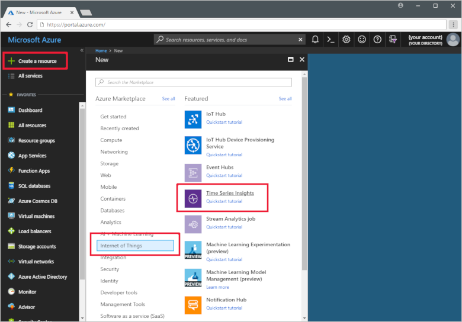
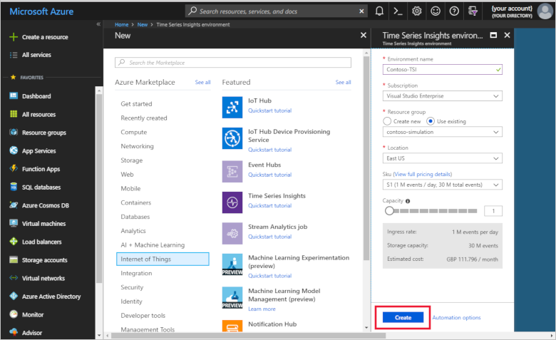
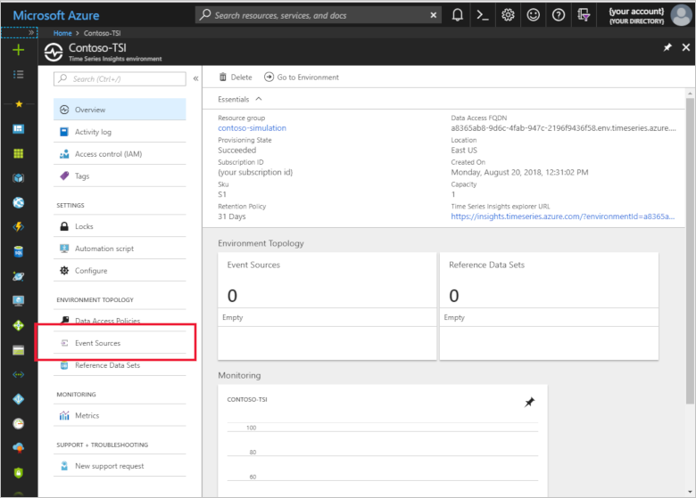
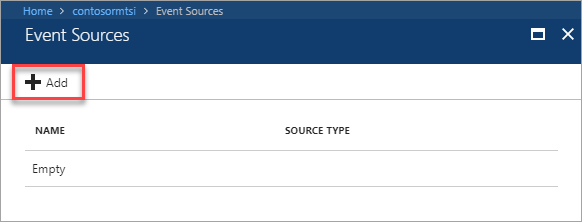
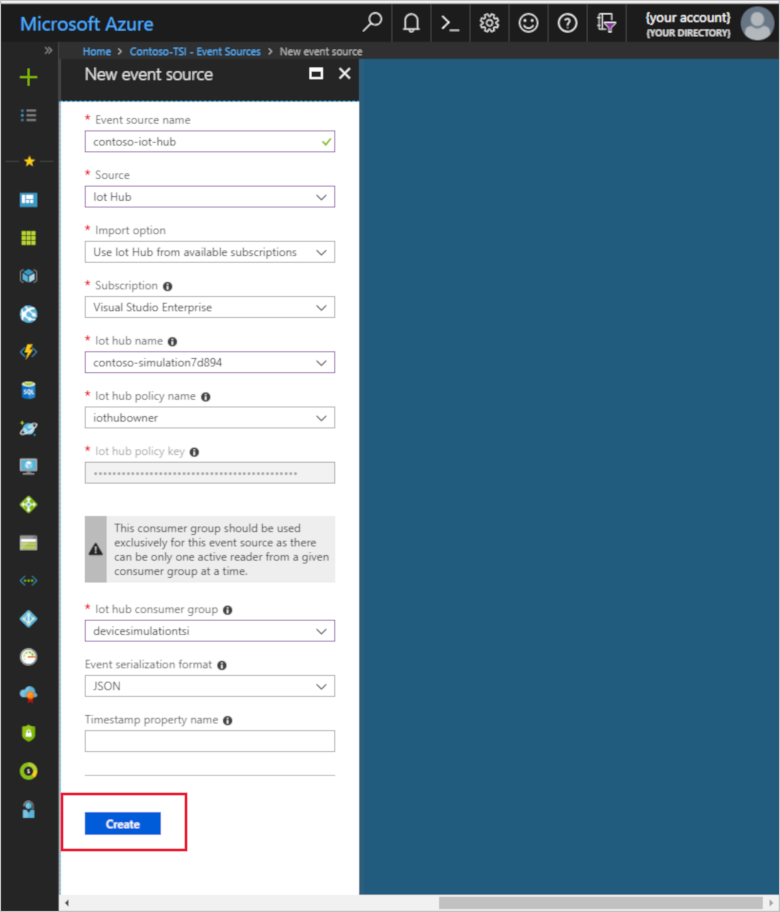

## Create a consumer group

You need to create a dedicated consumer group in your IoT hub to stream telemetry to Time Series Insights. An event source in Time Series Insights should have the exclusive use of an IoT Hub consumer group.

The following steps use the Azure CLI in the Azure Cloud Shell to create the consumer group:

1. The IoT hub is one of several resources created when you deployed the Device Simulation solution accelerator. Execute the following command find the name of your IoT hub - remember to use the name of your solution accelerator:

    ```azurecli-interactive
    az resource list --resource-group contoso-simulation -o table
    ```

    The IoT hub is the resource of type **Microsoft.Devices/IotHubs**.

1. Add a consumer group called **devicesimulationtsi** to the hub. In the following command use the name of your hub and solution accelerator:

    ```azurecli-interactive
    az iot hub consumer-group create --hub-name contoso-simulation7d894 --name devicesimulationtsi --resource-group contoso-simulation
    ```

    You can now close the Azure Cloud Shell.

## Create a new Time Series Insights environment

[Azure Time Series Insights](../articles/time-series-insights/time-series-insights-overview.md) is a fully managed analytics, storage, and visualization service for managing IoT-scale time-series data in the cloud. To create a new Time Series Insights environment:

1. Sign in to the [Azure portal](http://portal.azure.com/).

1. Select **Create a resource** > **Internet of Things** > **Time Series Insights**:

    

1. To create your Time Series Insights environment in the same resource group as your solution accelerator, use the values in the following table:

    | Setting | Value |
    | ------- | ----- |
    | Environment Name | The following screenshot uses the name **Contoso-TSI**. Choose your own unique name when you complete this step. |
    | Subscription | Select your Azure subscription in the drop-down. |
    | Resource group | **contoso-simulation**. Use the name of your solution accelerator. |
    | Location | This example uses **East US**. Create your environment in the same region as your Device simulation accelerator. |
    | Sku |**S1** |
    | Capacity | **1** |

    

    > [!NOTE]
    > Adding the Time Series Insights environment to the same resource group as the solution accelerator means that it's deleted when you delete the solution accelerator.

1. Click **Create**. It can take a few minutes for the environment to be created.

## Create event source

Create a new event source to connect to your IoT hub. Use the consumer group you created in the previous steps. A Time Series Insights event source requires a dedicated consumer group not in use by another service.

1. In the Azure portal, navigate to your new Time Series Environment.

1. On the left, click **Event Sources**:

    

1. Click **Add**:

    

1. To configure your IoT hub as a new event source, use the values in the following table:

    | Setting | Value |
    | ------- | ----- |
    | Event source Name | The following screenshot uses the name **contoso-iot-hub**. Use your own unique name when you complete this step. |
    | Source | **IoT Hub** |
    | Import option | **Use IoT Hub from available subscriptions** |
    | Subscription Id | Select your Azure subscription in the drop-down. |
    | Iot hub name | **contoso-simulation7d894**. Use the name of your IoT hub from your Device Simulation solution accelerator. |
    | Iot hub policy name | **iothubowner** |
    | Iot hub policy key | This field is populated automatically. |
    | Iot hub consumer group | **devicesimulationtsi** |
    | Event serialization format | **JSON** |
    | Timestamp property name | Leave blank |

    

1. Click **Create**.

> [!NOTE]
> You can [grant additional users access](../articles/time-series-insights/time-series-insights-data-access.md#grant-data-access) to the Time Series Insights explorer.