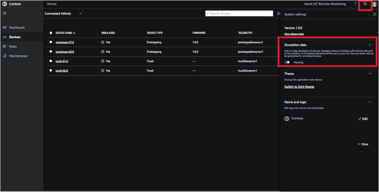
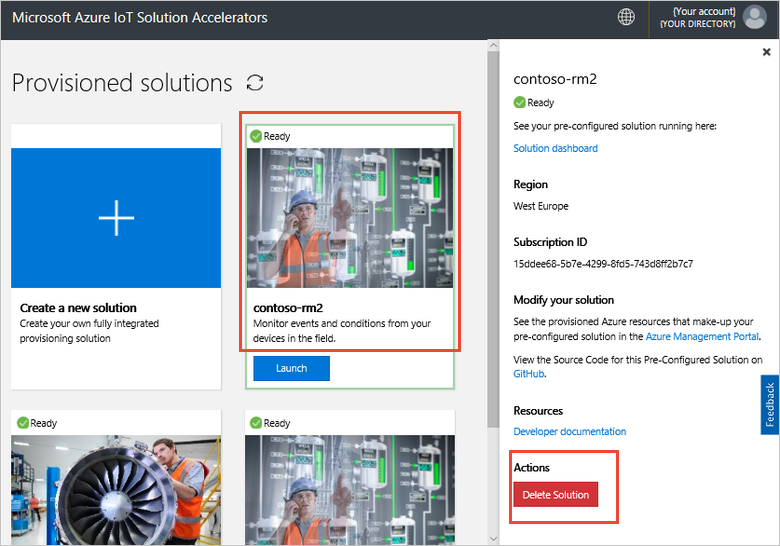
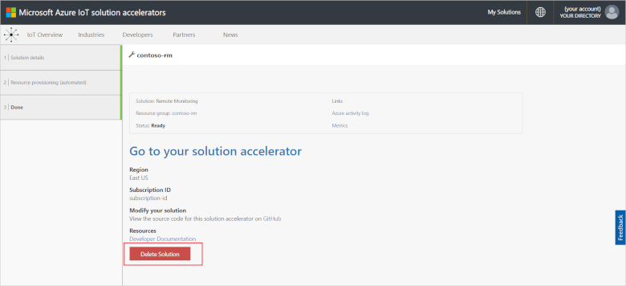

## Clean up resources

If you plan to move on to the next tutorial, leave the Remote Monitoring solution accelerator deployed. To reduce the costs of running the solution accelerator while you're not using it, you can stop the simulated devices in the settings panel:

You can restart the simulated devices when you're ready to start the next tutorial.

If you no longer need the solution accelerator, delete it from the [Provisioned solutions](https://www.azureiotsolutions.com/Accelerators#dashboard) page:

