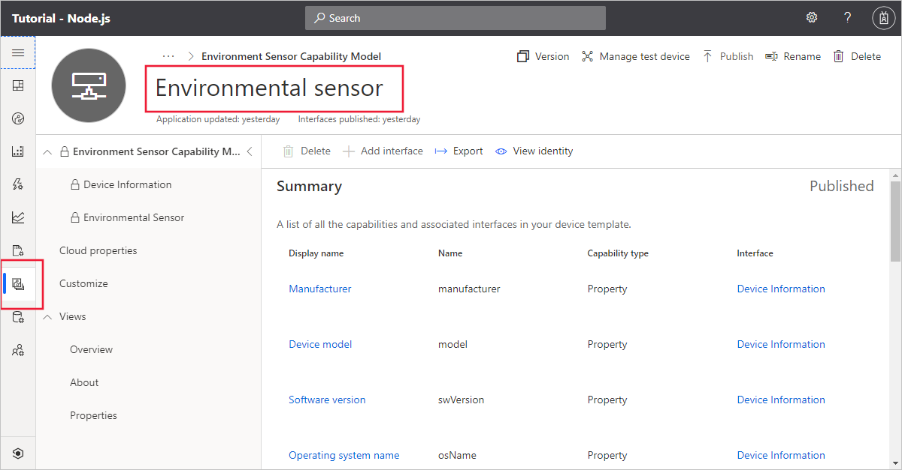
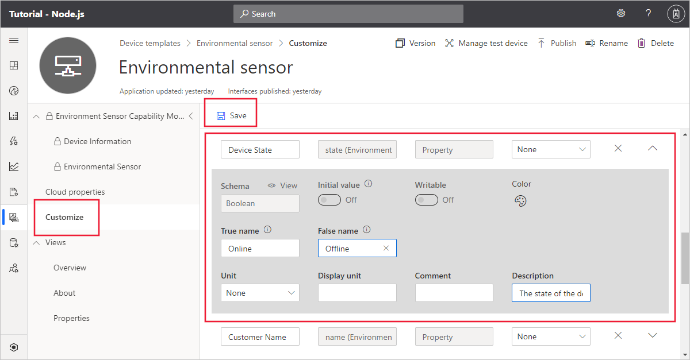
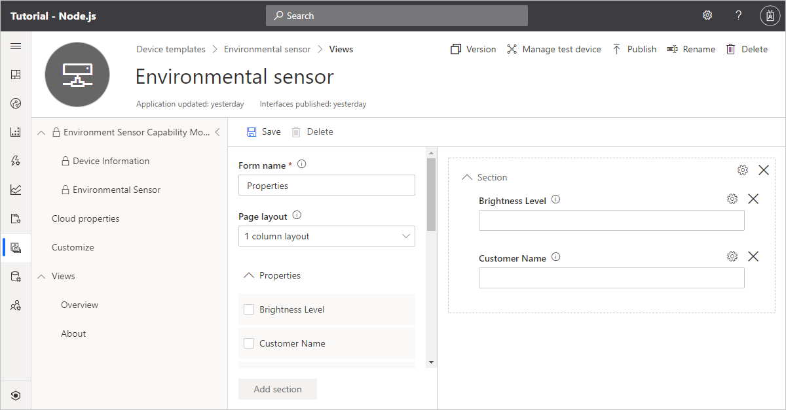
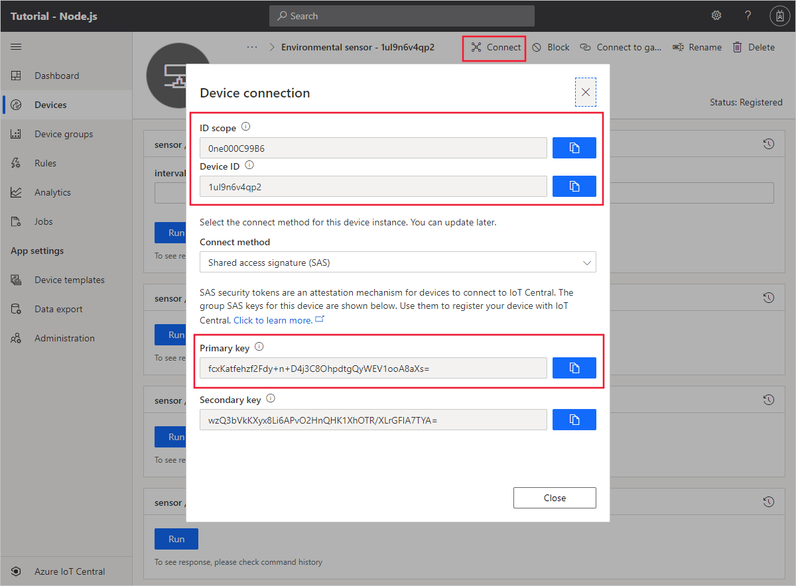

## Create a device template

Create a folder called `environmental-sensor` on your local machine.

Download the [Environmental sensor capability model](https://raw.githubusercontent.com/Azure/IoTPlugandPlay/9004219bff1e958b7cd6ff2a52209f4b7ae19396/samples/EnvironmentalSensorInline.capabilitymodel.json) JSON file and save it in the `environmental-sensor` folder.

Use a text editor to replace the two instances of `{YOUR_COMPANY_NAME_HERE}` with your company name in the `EnvironmentalSensorInline.capabilitymodel.json` file you downloaded. Use only the characters a-z, A-Z, 0-9, and underscore.

In your Azure IoT Central application, create a device template called *Environmental sensor* by importing the `EnvironmentalSensorInline.capabilitymodel.json` device capability model file:

The device capability model includes two interfaces: the standard **Device Information** interface and the custom **Environmental Sensor** interface. The **Environmental Sensor** interface defines the following capabilities:

| Type | Display Name | Description |
| ---- | ------------ | ----------- |
| Property | Device State     | The state of the device. Two states online/offline are available. |
| Property (writeable) | Customer Name    | The name of the customer currently operating the device. |
| Property (writeable) | Brightness Level | The brightness level for the light on the device. Can be specified as 1 (high), 2 (medium), 3 (low). |
| Telemetry | Temperature | Current temperature detected by the device. |
| Telemetry | Humidity    | Current humidity detected by the device. |
| Command | blink          | Begin blinking the LED on the device for given time interval. |
| Command | turnon         | Turn on the LED on the device. |
| Command | turnoff        | Turn off the LED on the device. |
| Command | rundiagnostics | This asynchronous command starts a diagnostics run on the device. |

To customize how the **Device State** property displays in your IoT Central application, select **Customize** in the device template. Expand the **Device State** entry, enter _Online_ as the **True name** and _Offline_ as the **False name**. Then save the changes:

## Create views

Views let you interact with devices connected to your IoT Central application. For example, you can have views that display telemetry, views that display properties, and views that let you edit writeable and cloud properties. Views are part of a device template.

To add some default views to your **Environmental sensor** device template, navigate to your device template, select **Views**, and select the **Generate Default views** tile. Make sure **Overview** and **About** are **On**, and then select **Generate default dashboard view(s)**. You now have two default views defined in your template.

The **Environmental Sensor** interface includes two writeable properties - **Customer Name** and **Brightness Level**. To create a view, you can use to edit these properties:

1. Select **Views** and then select the **Editing device and cloud data** tile.

1. Enter _Properties_ as the form name.

1. Select the **Brightness Level** and **Customer Name** properties. Then select **Add section**.

1. Save your changes.

## Publish the template

Before you can add a device that uses the **Environmental sensor** device template, you must publish it.

In the device template, select **Publish**. On the **Publish this device template to the application** panel, select **Publish**.

To check that the template is ready to use, navigate to the **Devices** page in your IoT Central application. The **Devices** section shows a list of the published devices in the application:

## Add a real device

In your Azure IoT Central application, add a real device to the device template you created in the previous section:

1. On the **Devices** page, select the **Environmental sensor** device template.

    > [!TIP]
    > Be sure to select the template to use before you select **+ New**, otherwise you'll create an unassociated device.

1. Select **+ New**.

1. Make sure that **Simulated** is **Off**. Then select **Create**.

Click on the device name, and then select **Connect**. Make a note of the device connection information on the **Device Connection** page - **ID scope**, **Device ID**, and **Primary key**. You need these values when you create your device code:

