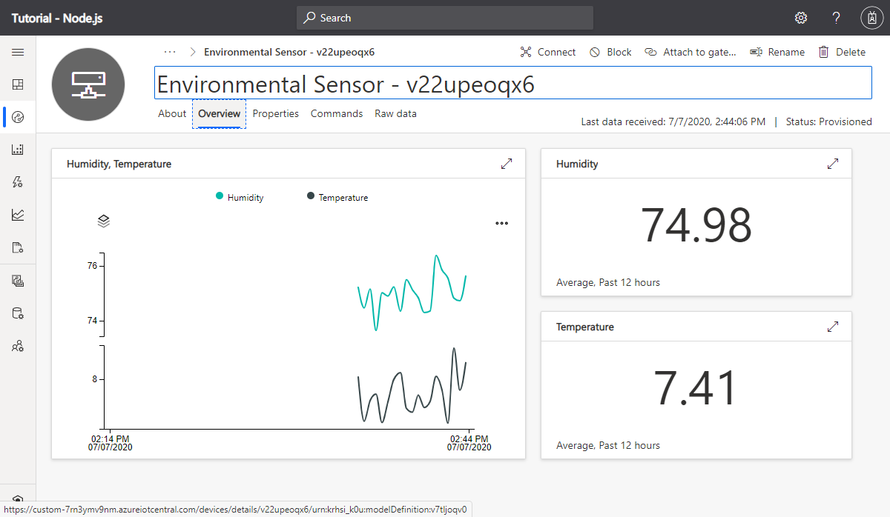
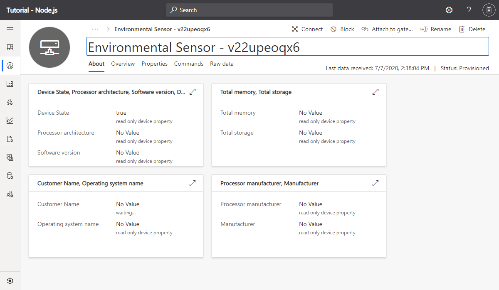
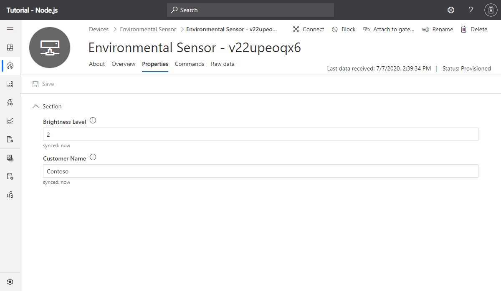
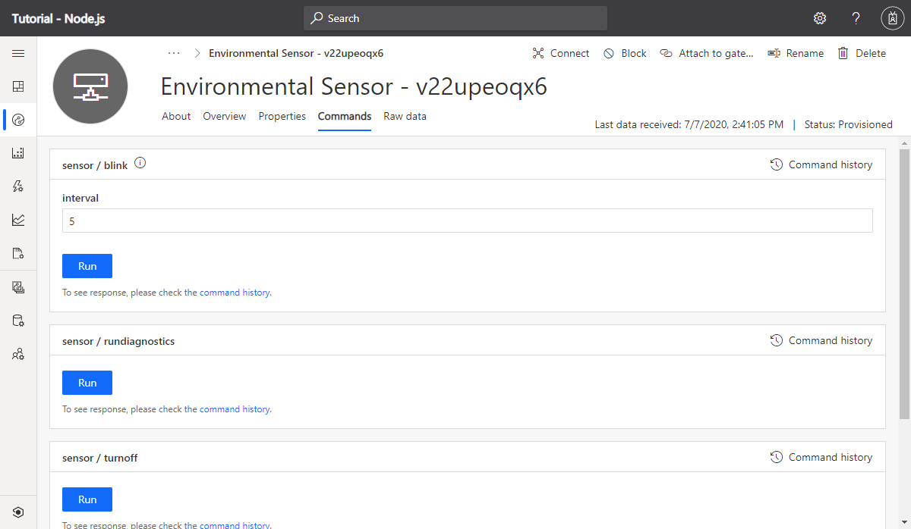

As an operator in your Azure IoT Central application, you can:

* View the telemetry sent by the device on the **Overview** page:

    

* View the device properties on the **About** page:

    

* Update writeable property values on the **Properties** page:

    

* Call the commands from the **Commands** page:

    

    
