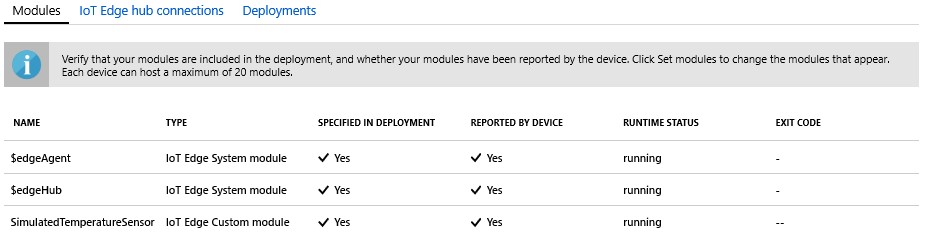

One of the key capabilities of Azure IoT Edge is being able to deploy modules to your IoT Edge devices from the cloud. An IoT Edge module is an executable package implemented as a container. In this section, we'll be deploying a pre-built module from [IoT Edge Modules section of the Azure Marketplace](https://azuremarketplace.microsoft.com/en-us/marketplace/apps/category/internet-of-things?page=1&subcategories=iot-edge-modules). This module generates telemetry for your simulated device.

1. In the Azure portal, enter `Simulated Temperature Sensor` into the search and open the Marketplace result.

   

2. In the **Subscription** field, select the subscription with the IoT Hub you're using, if it's not already.

3. In the **IoT Hub** field, select the name of the IoT Hub you're using, if it's not already.

4. In the **IoT Edge Device Name** field, enter `myEdgeDevice`, then select **Create**.

5. In the first step of the wizard, select **Next**.

6. In the **Specify Routes** step of the wizard, you should have a default route that sends all messages from all modules to IoT Hub. If not, add the following code then select **Next**.

   ```json
    {
    "routes": {
        "route": "FROM /messages/* INTO $upstream",
        "upstream": "FROM /messages/* INTO $upstream"
        }
    }
   ```

7. In the **Review Deployment** step of the wizard, select **Submit**.

8. Return to the device details page and select **Refresh**. In addition to the edgeAgent module that was created when you first started the service, you should see another runtime module called **edgeHub** and the **SimulatedTemperatureSensor** module listed.

   It may take a few minutes for the new modules to show up. The IoT Edge device has to retrieve its new deployment information from the cloud, start the containers, and then report its new status back to IoT Hub. 

   
