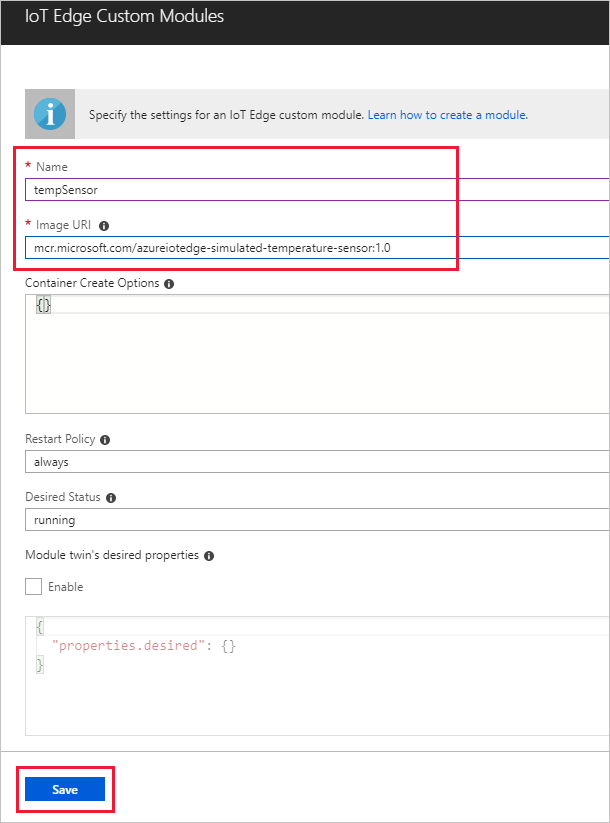
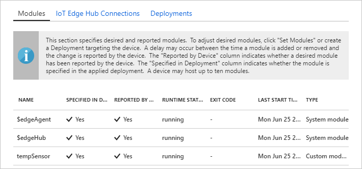

One of the key capabilities of Azure IoT Edge is being able to deploy modules to your IoT Edge devices from the cloud. An IoT Edge module is an executable package implemented as a container. In this section, you deploy a module that generates telemetry for your simulated device. 

1. In the Azure portal, navigate to your IoT hub.
1. Go to **IoT Edge** and select your IoT Edge device.
1. Select **Set Modules**.
1. In the **Deployment Modules** section of the page, click **Add** then select **IoT Edge Module**.
1. In the **Name** field, enter `tempSensor`. 
1. In the **Image URI** field, enter `mcr.microsoft.com/azureiotedge-simulated-temperature-sensor:1.0`. 
1. Leave the other settings unchanged, and select **Save**.

   

1. Back in the **Add modules** step, select **Next**.
1. In the **Specify routes** step, you should have a default route that sends all messages from all modules to IoT Hub. If not, add the following code then select **Next**.

   ```json
   {
       "routes": {
           "route": "FROM /messages/* INTO $upstream"
       }
   }
   ```

1. In the **Review Deployment** step, select **Submit**.
1. Return to the device details page and select **Refresh**. In addition to the edgeAgent module that was created when you first started the service, you should see another runtime module called **edgeHub** and the **tempSensor** module listed. 

   
